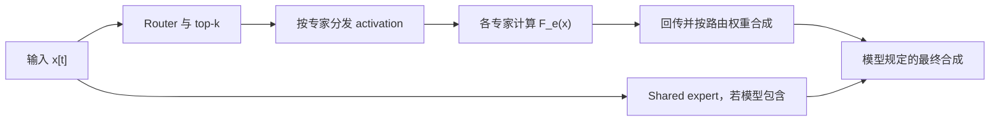
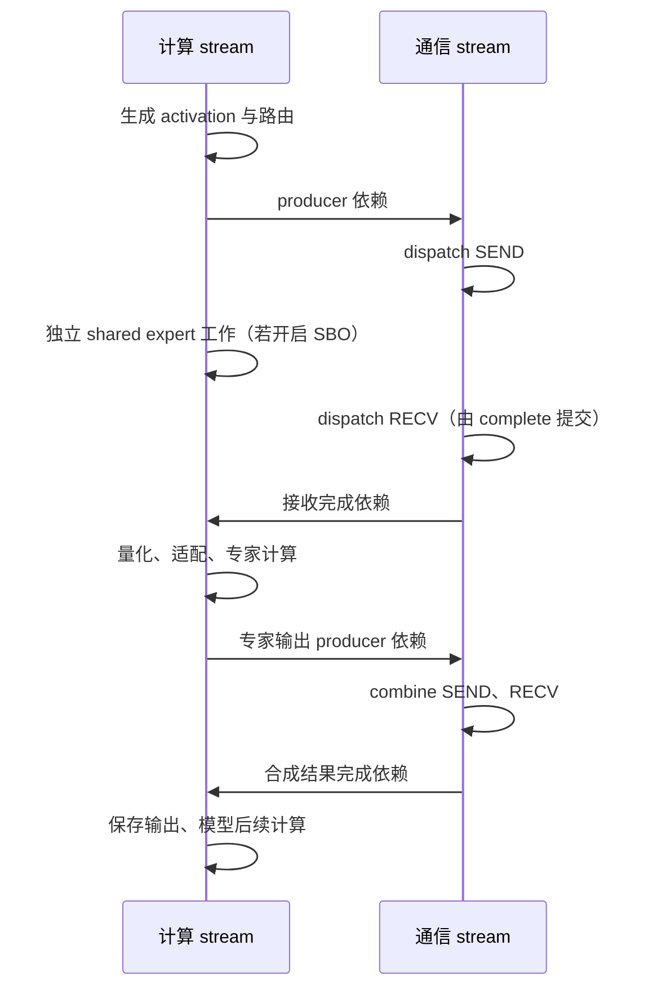
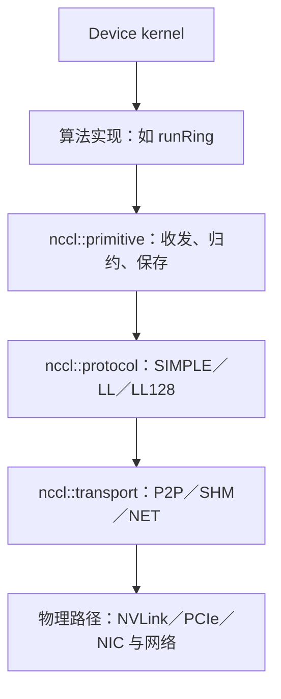
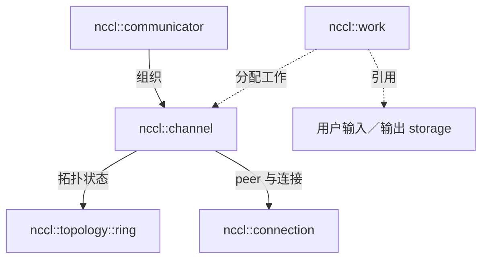
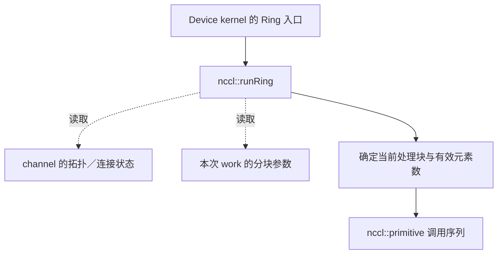
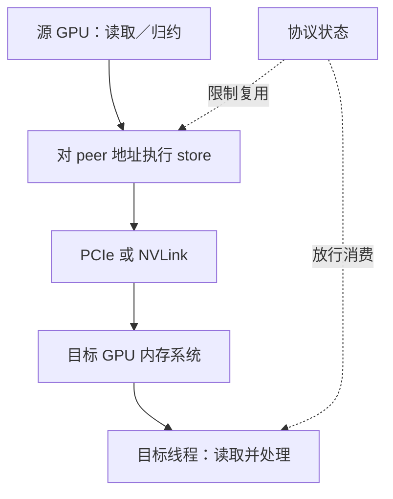
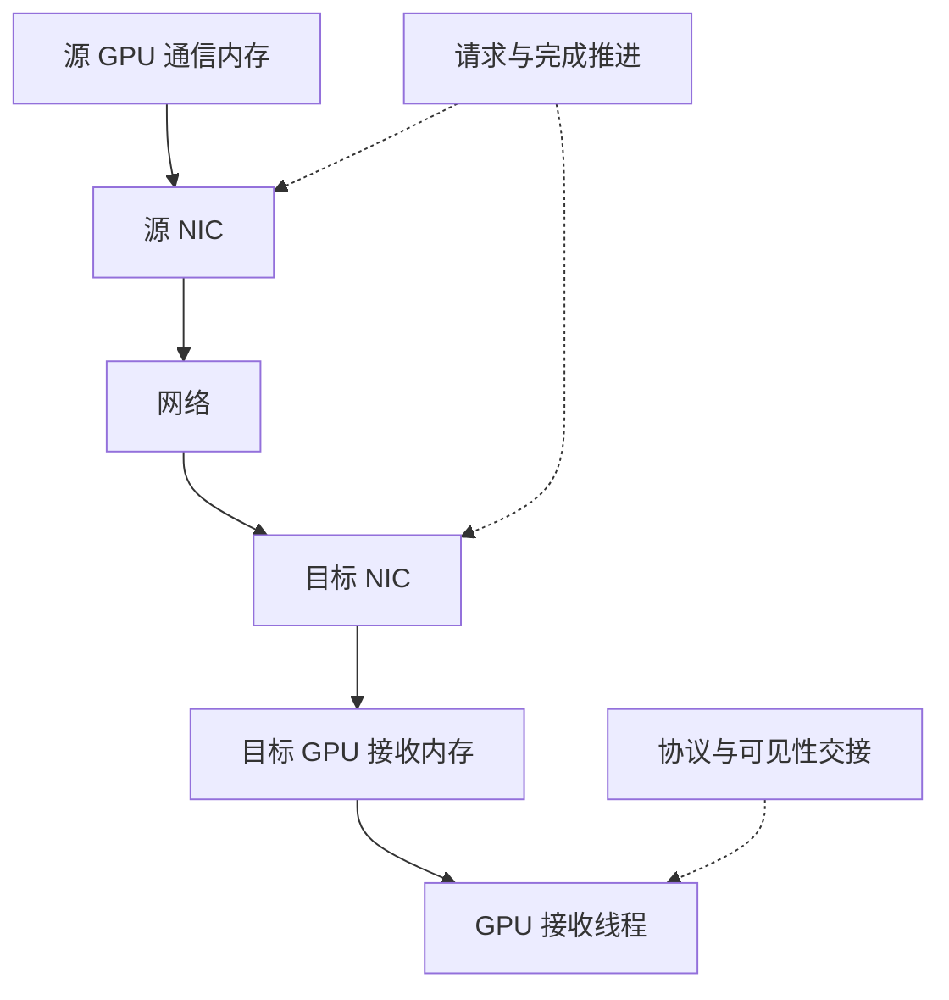

从 SGLang 调用追踪到 NCCL 通信与 MoE dispatch/combine，解释数据身份、执行依赖和资源生命周期如何决定正确性与性能。

<!-- more -->

# SGLang、NCCL 与 MoE EP：从职责边界到执行机制

**面向读者：** 已熟悉 CUDA、异步执行与 SGLang Runtime，并看过 NCCL EP Python 接口，但还不能把接口调用与底层通信机制连起来的读者。本文从通信概念开始，帮助读者区分对象职责，追踪一次 AllReduce 和一次 MoE dispatch/combine，并分析正确性条件与性能成本。

**核心问题与结论：** SGLang 的一次分布式执行如何落实为设备工作，哪些条件保证 token 送对、算对、合对？理解这条路径需要同时追踪数据身份、对象关系、执行依赖和资源生命周期；性能判断则要结合有效工作量、关键路径及硬件资源，不能仅由单个接口或 kernel 的表现推出整体收益。

**范围与依据：** 本文为五个 Level 的原理教程，源码核对日期为 2026-09-24。SGLang 主线固定于 `a705747b5b82`，普通 NCCL 使用 2.30.7，NCCL EP 底层走读使用 nccl-extensions 的 `e57f0dad43dc`；完整版本和引用见附录 B。MoE 主线限定为 LL、expert-major、BF16 通信及 Triton FP8 专家计算；八 GPU 的 NVLink/RDMA 场景是教学设定，SM120 微架构分析另注明条件。数值推演和 CPU 算术校验不等同 GPU 验证；本文未执行多 GPU 通信或性能测试，引用的 PR 历史结果也未复测，所读源码不据此认定为历史 wheel 的实际构建来源。

**阅读导航：**[能力体系](#intro) → [职责边界](#level-1) → [对象拓扑](#level-2) → [动态数据流](#level-3) → [执行机制](#level-4) → [问题分析](#level-5) → [微架构、源码与术语附录](#appendices)

<a id="intro"></a>

## 引入｜读完后，你能够做什么？

学习终点是形成一条可检查的解释链：从 SGLang 的调用，说明数据交给谁、如何找到目的地、何时能够被消费，继而解释哪些实现条件决定正确性与成本。

```text
理解并分析 SGLang 中的 NCCL / MoE EP 执行
│
├── 解释执行：建立系统模型
│   ├── Level 1 · 职责边界
│   │   ├── 解释 MoE 怎样计算、为何需要通信
│   │   └── 判断各步骤由哪个组件负责
│   └── Level 2 · 对象拓扑
│       ├── 建立 token → expert → rank → GPU 的映射
│       └── 说明 NCCL communicator、EP group、EP handle 和存储的关系
│
├── 追踪实现：让模型对应实际代码
│   └── Level 3 · 动态数据流
│       ├── 追踪一次 AllReduce 怎样产生所有 rank 的结果
│       ├── 追踪一个 token 怎样送达、计算并合回原位
│       └── 指出位置、格式、身份与执行依赖的变化
│
└── 分析问题：从机制推导条件与成本
    ├── Level 4 · 执行机制
    │   ├── 将局部源码对应到线程、访存、同步和传输
    │   └── 推导可见性、复用条件和资源需求
    └── Level 5 · 正确性与性能推理
        ├── 定位可能失效的条件或关键路径
        └── 提出可验证假设，界定结论的适用范围
```

前两层回答“系统由什么组成”；第三层让这些对象运转起来；第四层拆开关键操作；第五层利用这些机制解释变化。阅读不需要先掌握通信术语，但默认你已熟悉 CUDA 和 SGLang Runtime，能读 Python、C++ 与 CUDA 源码。

### 两个问题贯穿全文

**问题一：普通 NCCL 如何完成一次 AllReduce？** 两台服务器各有四张 GPU，共八个 rank；节点内 NVLink，节点间 RDMA。每个 rank 对相同长度的 FP32 向量做 SUM AllReduce，分别考虑每个 rank 输入 4 KiB 与 64 MiB。为了能够手算，令 rank `r` 的每个输入元素都等于 `r+1`，于是每个输出元素应为 36。Ring 是我们选定的推演路径；没有运行记录时，不声称 NCCL 在这两个大小上一定选择 Ring。

**问题二：NCCL EP 如何让一个 token 送对、算对、合对？** 四个 EP rank，八个专家连续均分，top-k=2，本地 token 数为 `[0,16,32,64]`。追踪 rank 2 的 token 5：它选择 E1、E6，权重分别为 0.25、0.75。需要具体计数时，补全同一场景：其他 111 个 token 均选择 E0、E7；取发送容量 `C=64`、hidden size `H=4096`。这是一组人为指定的合法路由，用来让计数、偏移与容量可核算，不是模型的真实路由测量。

全篇对第二个问题使用 **LL、EXPERT_MAJOR、BF16 通信、接收后 FP8 量化、Triton 专家计算**这条路径。HT 与其他布局只在界定适用范围时出现。

<a id="level-1"></a>

## Level 1｜职责边界：MoE 为什么需要这些组件？

**本层结论：MoE 的计算目标决定数据必须送往哪些专家；专家放置决定其中哪些步骤需要跨设备通信。**

### 1.1 一个 MoE 层究竟算什么？

一个输入 token 在这里首先是一行 hidden activation：`x[t] ∈ R^H`。Router 产生专家分数，选择策略给出 K 个专家 ID 与相应权重。对本文的 routed 分支，可以写成：

$$
y_t^{routed}=\sum_{k=0}^{K-1}w_{t,k}F_{e_{t,k}}(x_t).
$$

`F_e` 是专家网络；在这条 gated SiLU 路径中，它包含 gate/up 投影、激活与逐元素乘法、down 投影。Router 的分数生成、top-k 选择和专家 GEMM 是不同步骤。模型还可能有独立 shared expert，其输出对当前 token 另行计算，再按模型规定与 routed 输出组合。



对追踪 token，目标是 `0.25·F₁(x₂,₅)+0.75·F₆(x₂,₅)`。若两个专家输出的第一个坐标分别是 4 和 12，这个坐标的 routed 结果就是 10。

权重通常应作用在专家输出上。将输入改成 `w·x` 再执行非线性专家，一般不能保持 `F(w·x)=w·F(x)`。因此“在何处乘权重”是数据契约的一部分，取决于具体模型定义（如Lama 4）。所研究的 Triton 适配禁止 `apply_router_weight_on_input`，实际路由权重保留给 NCCL EP combine。[Triton 适配源码][s-triton]

### 1.2 专家分布到不同 GPU 后，增加什么工作？

**Expert Parallelism（EP）**把专家集合分给一组执行参与者。本文先采用常见的一进程一 GPU 映射，每个 rank 拥有两个完整专家。Rank 是它在某个通信组内的编号；同一 GPU 在另一组中的编号可能不同。

源 rank 拥有 token，并不意味着它拥有该 token 选中的专家。Rank 2 拥有 E4、E5，但 token 5 要去 E1、E6，因此执行需要三件事：

1. **Dispatch**：依据路由，把 activation 及必要身份信息送至拥有目标专家的 rank，并准备专家能使用的布局。
2. **Expert compute**：在目标 rank 对各专家收到的有效行执行其网络。
3. **Combine**：把结果关联回原始 token，完成回传与加权合成。

输入 token 只有 112 个，token–expert 计算关系却有 `112×2=224` 条。路由复制是逻辑关系；物理通信可以对同一目标 rank 去重，不能把路由条数直接当作网络消息数。第 4 层会给出这一路径的具体实现。

Rank 0 没有自己的输入 token，但持有 E0、E1，仍要接收远端工作并返回结果。**本地请求为空只约束本地最终输出，不决定本地专家有没有工作。**

### 1.3 通信操作描述什么结果？

一个 **NCCL communicator** 建立一组参与者的通信上下文。**Collective** 是这组参与者共同完成的操作；每个 rank 的调用必须在参与者、操作顺序及对应参数上匹配。通信对象是 tensor 中的数值，NCCL 不知道这些数值在模型里叫 token 还是梯度。

| 操作            | 输入与输出关系                      | 在本文中的用途                |
| ------------- | ---------------------------- | ---------------------- |
| Send / Recv   | 指定参与者之间发送与接收                 | 理解一条传输边                |
| Broadcast     | 根 rank 的数据提供给组内参与者           | 建立“谁拥有结果”的概念           |
| Reduce        | 按 SUM 等规则归约，指定 rank 得到结果     | 建立归约语义                 |
| AllReduce     | 对应位置归约后，每个 rank 都有完整结果       | 问题一的目标                 |
| ReduceScatter | 先归约，结果按 rank 分片保留            | Ring AllReduce 的前半部分   |
| AllGather     | 收集每个 rank 的分片，所有 rank 得到完整集合 | Ring AllReduce 的后半部分   |
| All-to-All    | 各 rank 给不同目标发送不同数据           | 理解 EP 的交换关系；不限定其实现 API |

SUM AllReduce 满足 $y_r[i]=\sum_q x_q[i]$。其中 AllReduce 规定结果分布，SUM 规定归约规则。ReduceScatter 再接 AllGather 可以实现这一数学目标，但具体 NCCL kernel 能把相邻步骤融合，不要求用户提交两次 API。[通信语义][n-collectives]

MoE dispatch 包含不规则目的地、身份映射和布局转换，未必通过一个普通 All-to-All API 实现。后续我们将直接追入 EP 的设备端通信。

### 1.4 各组件分别负责什么？

| 组件 | 本次工作中的责任 | 它需要交付给下一层的东西 |
|---|---|---|
| SGLang Runtime | 组织当前 forward、CUDA Graph、bucket 和批次执行 | 本轮张量及执行上下文 |
| 模型层与路由逻辑 | 按模型定义生成路由、组织 shared/routed 分支 | activation、expert IDs、权重 |
| MoE dispatcher | 接入 dispatch/combine，衔接输入输出格式和生命周期 | 专家输入、有效计数、可回传结果 |
| MoE compute backend | 执行本地专家网络 | 与接收身份一一对应的专家输出 |
| Python binding | 把对象与参数连接到 native API | descriptor、native 指针、stream |
| NCCL / NCCL EP native | 管理通信资源，组织协议及设备工作 | 满足通信与布局契约的数据 |
| GPU kernel、互联与 NIC | 执行索引、搬运、归约、同步及物理传输 | 可被后续消费者读取的结果 |

Backend 与 Runtime 在 stream、CUDA Graph 和资源复用处相接；“具体算子实现”也有执行和生命周期责任。一个模型使用的通常是 backend 组合：选择 NCCL EP 并不替代专家 GEMM backend，也不决定 attention 的实现。[接入路径][s-dispatch]

**本层自检**：如果把 NCCL EP 换成另一种通信 backend，专家函数与 MoE 数学目标可保持不变；需要重新确认的是路由、布局、数值格式和执行契约是否兼容。

<a id="level-2"></a>

## Level 2｜对象拓扑：这些职责由什么承载？

**本层结论：必须同时画清参与者映射、软件对象关系和资源所有权，才能判断数据会去哪里、对象能否共享。**

### 2.1 token、expert、rank 与 GPU 的映射

对本文连续均匀放置，`L=E/W=2`，global expert `g` 的目标 rank 为 `g//L`，local expert 为 `g%L`。这是选定布局的映射，不适用于所有动态专家放置策略。

| EP rank | 对应设备（本例） | 本地输入 token 数 | 拥有的 global experts |
|---|---|---:|---|
| 0 | GPU 0 | 0 | E0、E1 |
| 1 | GPU 1 | 16 | E2、E3 |
| 2 | GPU 2 | 32 | E4、E5 |
| 3 | GPU 3 | 64 | E6、E7 |

token 身份至少需要 `(源 rank, 源行号)`；一条路由进一步带上 top-k 位置 `k`。本例中的 `(2,5,0)` 去 rank 0 的 local expert 1，`(2,5,1)` 去 rank 3 的 local expert 0。

TP 表示一个计算被 tensor 分片共同执行，DP 表示数据工作在组间分配，EP 表示专家分布。它们可以重用参与者，但编号与责任要分别追踪。指定 PR 栈的配置校验将 NCCL EP 解析为 `EP=TP`，这是该接入路径的配置约束，不是 EP 的数学定义。[配置校验增量](https://github.com/Laceprndpm/sglang/commit/50ecc92553e91fdd850001e0f05b9936e4b44da8)

### 2.2 NCCL communicator、EP group 与 EP handle 的关系

SGLang 取得已有 NCCL communicator，将其包装后传给 `nccl.ep.Group.create`，创建 EP group。[对象创建源码][s-dispatch]

| 对象                | 实际负责的内容                                               |
| ----------------- | ----------------------------------------------------- |
| NCCL communicator | rank 身份、通信参与者与底层通信连接                                  |
| EP group          | EP 配置、共享通信缓冲区、收发进度、通知资源和缓冲区轮换状态                       |
| EP handle         | 当前路由的引用、token↔专家 slot 映射、布局信息和等待 `complete()` 提交的后续操作 |
| SGLang 分配的 tensor | 输入、专家接收输出、`expert_counters` 和最终 combine 输出等           |

源码依据：[EP group 与 EP handle 的定义][ep-host]、[SGLang tensor 分配][s-dispatch]。

```text
NCCL communicator
  + EP 配置：专家数量、通信模式、token 容量
  + EP 共享通信资源：传输缓冲区、通知资源
  + 共享协议状态：收发进度、缓冲区轮换状态
  = EP group

EP group
  + 当前路由的引用：top-k 专家 ID、token 数、top-k 数
  + 数据布局信息
  + 本次路由的映射：原 token ↔ 专家接收 slot
  + 本次操作的阶段状态：等待 complete() 提交的后续操作
  = EP handle
```

对于普通 collective，PyTorch 的 `ProcessGroupNCCL` 和 SGLang 的 `PyNcclCommunicator` 是两种上层入口。后者的 `all_reduce` 可以直接到 native `ncclAllReduce`；不能把两者及 `nccl4py` 强行串成每次调用必经的三层。[PyNccl 入口][s-pynccl]

### 2.3 实际存储、有效范围与身份

本节限定为附录 B 的固定版本：**SGLang NCCL EP、native LL、`EXPERT_MAJOR`、BF16 通信、接收后 FP8 量化、Triton 专家计算**。SGLang 复用了名为 `DeepEPLLDispatchOutput` 的返回结构，但本节通信由 NCCL EP 执行。

**最终专家输入是 `[L,W·C,H]`，每个专家的有效数据占据连续前缀。`W·C` 只是容量，不能把它拆开后解释为“每个来源 rank 固定占 C 行”。接收端 native CUDA kernel 在 dispatch 内完成按专家展开和 compact；Triton 接手时，这一步已经完成。** [SGLang 调用][s-dispatch]、[native 接收 kernel][ep-device]

#### 2.3.1 源 rank：一份 activation，K 条路由

定义 `W` 为 EP rank 数，`L` 为每 rank 的专家数，`T_r` 为源 rank 本轮提交的 token 行数，`C` 为每 rank 发送容量上限，`M=W·C`。CUDA Graph 的提交行数可能包含 padding；无效行通过 `topk_ids=-1` 排除，不产生有效路由。

| 源端对象 | shape / 类型 | 实际含义 |
|---|---|---|
| `hidden_states` | `[T_r,H]`，BF16 | token-major；一个 token 只有一行 activation |
| `topk_ids` | `[T_r,K]`，本路径 int64 | 每个 token 选择的 K 个 global expert IDs |
| `topk_weights` | `[T_r,K]`，FP32 | 每条路由的合成权重，保留在源端供 combine 使用 |

例如 token `(r,t)` 选择 E0、E1，输入仍只有 `hidden_states[t,:]` 一份，未预先扩成 `[T_r,K,H]`。发送 kernel 读取这一行和它的 top-k 路由，生成带原 token 行号、专家 ID 列表的消息 header。本路径不在 dispatch 消息中携带 top-k 权重，也不先给 activation 乘权重。[发送 kernel][ep-device]、[EXPERT_MAJOR 参数约束][ep-host]

#### 2.3.2 发送：同一个 token 发往同一个目标 rank，只发送一份 payload

去重的单位是 **`(source_rank, token_row, destination_rank)`**。同一个 token 的多个目标专家若在同一目标 rank，只让这些路由中的第一个 top-k 位置发消息；header 仍保留各条专家路由。不同 token 不会因为 activation 相同而合并，同一 token 发往不同目标 rank 仍需各发一份。[去重与发送 slot 分配][ep-device]

```text
同一个 token 选 E0、E1；二者都在 rank 0：
  源端一份 x → 向 rank 0 发一份 x + 路由 header
             → rank 0 接收后为 E0、E1 各写一份专家输入

同一个 token 选 E1、E6；分别在 rank 0、rank 3：
  源端一份 x → 向 rank 0 发一份，向 rank 3 再发一份
```

因此，对 token `t`，发送份数是其有效 top-k 路由中不同目标 rank 的数量；专家计算次数仍是有效专家路由数。本文补全示例中，每个 token 的两个专家都分处两个 rank，所以有 224 份目标端 token 消息，恰好没有利用到同目标 rank 去重。这是 token 消息计数，不是 NIC packet 数。

发送侧为每个目标 rank 维护计数，通过 `u=atomicAdd(rankSentCnt+d,1)` 分配消息 slot。`u` 是“源 rank 发往 d 的消息序号”，不保证等于原 token 行号 `t`；原始 `t` 保存在 header 中。

#### 2.3.3 传输接收暂存：按来源 rank 分区，还没有 expert 维

目标 rank 的 native 接收暂存区为每个来源 rank 预留 C 个消息 slot。若只看 payload 的逻辑位置，可理解为 `[W,C,H]`；真实内存还包含 header 等字段，不能直接把整个通信 buffer 当作一个 BF16 三维 tensor。

| 传输路径 | 每个来源 rank 分区内的物理组织 | 发送时的数据搬运 |
|---|---|---|
| 跨 LSA 的 RDMA 路径 | C 条记录，每条内部依次为：`header → payload → recipe 附加字段` | 先把消息放入源端发送暂存，再由 GIN put 传输 |
| 同 LSA、P2P 可达路径 | C 个 header 连续排列，其后是 C 个 payload slot | header 来自发送暂存；payload 从源 activation 直接写到对端暂存，省去 payload 经源端发送暂存的中转 |

这里的 payload/scales 字节组织由量化 recipe 决定；本文 BF16 路径不传输后续 SGLang 生成的 FP8 group scales。同 LSA 分支在代码中常命名为 NVLink 路径，实际可达性依据 LSA/P2P 条件判断。[`sendToken` 与接收寻址][ep-device]

**这里没有 `[expert,rank,C,H]` 的按专家暂存区。** 一个消息可以同时服务目标 rank 上的多个专家，所以 native 暂存先按来源 rank 存消息，再在接收处理中按 header 展开专家路由。

对每个来源 rank `r`，消息 slot 的有效范围是 `[0,n_r)`；各 rank 的容量分区之间可以存在空槽。这时只有某个 expert 的总 counter，还不能拿来描述这个传输暂存区的有效位置。

#### 2.3.4 接收与 compact：native dispatch 直接写出专家连续前缀

SGLang 预先分配 `recv_tokens[L,M,H]`，BF16、row-major，stride 为 `(M·H,H,1)`。native LL 接收 kernel 遍历收到的消息及其 top-k 项；对本 rank 上的每条专家路由，执行以下操作：

```text
e = 目标 global expert 在本 rank 的 local expert 编号
原子执行以下读改写（两步整体不可分割）：
    s = expert_counters[e]          # 取更新前的值，作为本 token 的行号
    expert_counters[e] = s + 1      # 将加 1 后的值写回共享 counter
q = e*M + s
recv_tokens[e,s,:] = 收到的消息 payload
source_info 中记录：这个消息的第 k 条路由对应展平专家行 q
```

所有来源 rank 给同一个 expert 写数据时，共用 `expert_counters[e]` 这个分配器。因此该 expert 的 s 连续取值 `0,1,...,count[e]-1`，不会为每个来源 rank 留 C 行间隔；具体 token 顺序取决于原子分配次序。[`atomicAdd(outCnt + localExpertIdx, 1)` 与 `copyRecvTokenData`][ep-device]

这一步同时完成 **路由展开、数据搬运、专家内部 compact 和反向映射记录**。它由 NCCL EP native CUDA 接收 kernel 完成。SGLang 的 `dispatch_a` 提交 SEND；`dispatch_b` 调用 `complete()` 提交 RECV，后续量化按 stream 依赖消费结果。[两阶段调用][s-dispatch]、[native 接收分支][ep-device]

用 `W=2,C=2`、同一个 expert 从两个 rank 各收一个 token 的例子：

```text
传输暂存的 payload 逻辑视图：
  source rank 0: [A, 空]
  source rank 1: [B, 空]

native 接收 kernel 搬运后：
  recv_tokens[e,:,:] = [A, B, 空, 空]   # 也可能为 [B,A,空,空]
  expert_counters[e] = 2
```

因此，读取专家输入可以直接用 `recv_tokens[e,0:count[e],:]`。你提出的索引表 `[0,2,x,x]` 加 counter=2，适合保留原 buffer、通过 gather 读取有效位置的另一种实现；**此 native LL 分支选择实际搬运 payload，所以不使用这种索引表读取专家输入**。

compact 的范围必须说清楚：**每个 expert 内部连续，expert 之间仍有容量 padding。** 例如两个专家的计数分别为 2、1，M=4：

```text
expert 0: [A, B, 空, 空]
expert 1: [D, 空, 空, 空]

展平行号： 0  1   2   3   4   5   6   7
展平内容：[A, B, 空, 空, D, 空, 空, 空]
```

最终 shape 仍是 `[L,M,H]`，不会缩成 `[sum(count),H]`。即使把它 view 成 `[L,W,C,H]`，第二维也不再具有来源 rank 的语义。

#### 2.3.5 FP8 与 Triton：改变数值格式，保留专家 slot 身份

从 native dispatch 输出到 combine 输入，实际经历下面的存储转换：

| 阶段 / 负责组件 | 数据 shape / 类型 | 有效位置与是否搬动行 |
|---|---|---|
| native LL 接收完成 | `recv_tokens[L,M,H]`，BF16 | 每个 expert 的前 `count[e]` 行有效；专家内部 compact 已完成 |
| SGLang `_quantize_fp8` | FP8 `[L,M,H]`；FP32 scales `[L,M,H/128]` | 按 count 限定有效行，每行每 128 个 hidden 元素一组；保留 `(e,s)` |
| Triton `prepare_expert_slots` | BF16 `[L·M,H]`；IDs `[L·M,1]`；weights `[L·M,1]` | 对有效行反量化并写 local expert ID；无效行写零、ID=-1；权重设为 1 |
| 通用 `fused_experts_impl` | 按 local expert 执行 FP8 专家计算 | 内部生成专家分组与 block padding 索引，执行再量化和两次 GEMM |
| Triton 适配返回 | BF16 `[L,M,H]` | 计算输出恢复为原 expert slot shape，供 native combine 按 q 读取 |

`prepare_expert_slots` 的索引是 `e=slot//M`、`s=slot%M`，有效条件是 `s<count[e]`。它分配并遍历 `L·M` 个 slot，没有把各 expert 的有效行再拼成一个无空洞的大矩阵。内部 GEMM 的分组索引和 block padding 是计算组织，不是前面传输暂存的 compact。[Triton 适配][s-triton]、[通用专家计算][s-fused]

这里 `masked_m` 就是 int32 的 `expert_counters[L]`，不是逐 slot 的 bool mask。有效条件由 counter 推导。适配中的权重 1 也不是 router 的真实 top-k 权重；真实权重仍由源 rank 上的 NCCL EP combine 使用。

这个兼容路径存在“BF16 接收 → FP8 量化 → 适配时反量化为 BF16 → 通用 FP8 GEMM 再量化”的额外转换，也有容量大小的 scratch。它并不意味着量化、适配和全部辅助操作只按实际 token 总数分配或执行。[兼容路径说明与实现][s-triton]

#### 2.3.6 counter、offset、source-info 分别描述什么？

| 元数据 | 本路径的含义与使用方式 |
|---|---|
| `expert_counters[L]`，int32 | 每个 local expert 的实际路由行数，也是 native 接收端的行分配器；不是 `[L,W]` 的分来源计数 |
| `expert_offsets[L+1]`、`recv_total[1]`，int32 | SGLang 分配并每轮清零，但这个 native LL dispatch 分支没有把它们填成 compact 前缀和/总数，专家计算也不读取它们 |
| `expected_m` | 根据源端提交行数等信息计算的估计值，不决定有效行范围 |
| native `source_info` | 记录每个来源 rank 的消息数量，以及消息的原 token 行号、各 top-k 项对应的展平专家行 q；用于 combine 回溯身份 |

HT 的 metadata 预处理有处理 offsets/total 的代码，但不能据此认为这条 LL 路径也生成了它们。[SGLang 分配与清零][s-dispatch]、[LL 参数传递及 HT metadata 分支][ep-host]

身份映射可以在本节直接写全。设消息来自源 rank r，位于该来源分区的消息 slot u，header 中的原 token 行号为 t；其 top-k 位置 k 选择了本 rank 的 expert e：

```text
源 token: (r,t)，路由位置 k
  → 目标 rank 接收暂存中的消息 (r,u)       # 同一消息可供多个本地专家使用
  → native 分配专家 slot (e,s)
  → q=e*M+s，保存到 source_info
  → 专家计算在 q 对应位置产生输出
  → combine 读 source_info，将结果送回源 rank 的 (t,k) 返回 slot
  → 源 rank 按 topk_weights[t,k] 加权求和，得到 combined[t,:]
```

固定 native 版本的 source-info 是 int32 表：前 W 项存每个来源 rank 的消息数，后面每个消息占 `K+1` 项。对应偏移为：

```text
b = W + (r*C+u)*(K+1)
source_info[b]     = t
source_info[b+1+k] = q     # 不属于当前 rank 的 top-k 项记为 -1
```

因此，不需要在 `recv_tokens` 里继续保留一个来源 rank 维，仍能将每份专家结果送回正确的 token 和 top-k 位置。若 compute 另行重排输出，就必须恢复 q 对应关系或同步修改回传映射。本路径的 Triton 适配保留这一契约。[native 身份记录与 combine][ep-device]、[Triton 返回布局][s-triton]

#### 2.3.7 代入本文的容量与路由例子

本文 `W=4,L=2,C=64,H=4096`，所以 `M=256`。Rank 0 的 E0 从 source rank 1、2、3 分别收到 16、31、64 条路由，合计 111；E1 只收到 rank 2 的 token 5，计数 1：

```text
expert_counters = [111,1]
recv_tokens.shape = [2,256,4096]

recv_tokens[0,  0:111, :]  # E0 的连续有效输入；来源 rank 可混排
recv_tokens[0,111:256, :]  # 无效容量
recv_tokens[1,    0:1, :]  # E1 的有效输入，即源 rank 2 的 token 5
recv_tokens[1,  1:256, :]  # 无效容量
```

E1 的有效行是它自己的 s=0，展平 q=256；不是 `source_rank*C+token_row=133`。E0 内各 token 的具体 s 则不能由来源 rank 或原 token 行号预先推断。

BF16 接收区分配 4 MiB，FP8 区分配 2 MiB，FP32 group scales 分配 64 KiB；Triton 适配还分配 `[512,4096]` 的 BF16 中间区，占 4 MiB，另有路由索引和 GEMM scratch。Rank 0 的有效 BF16 专家输入只有 `112×4096×2=896 KiB`。这些分配容量、有效数据量和物理通信量是不同的数，GEMM 的 block padding 与辅助 kernel 工作量也需另外计算。

`combined` 的底层容量为 `[C,H]`，本轮返回 `[:T_r]`，恢复源端 token-major。Rank 0 虽然计算了 112 条专家路由，但本地原始 token 数为 0，最终本地 combine 输出仍是 `[0,H]`；它的专家结果已回传给其他源 rank。[接收和输出分配][s-dispatch]
4 Graph executable 与分批执行如何改变对象关系？

**Graph executable 是可重放的 CUDA 执行图，它引用的资源必须持续有效；子批重叠执行还要求各自使用的状态和缓冲区相互隔离。** 一次 MoE 执行需要 EP group、EP handle、输入与路由存储，以及接收和 combine 暂存区。Graph executable 会反复重放引用这些资源的设备工作，因此不能在捕获后就释放它们。

串行执行时，相容的 MoE 层可以依次借用同一套资源。如果启用 TBO（Two-Batch Overlap，将批次拆为两个子批并交错执行），子批 0 尚未用完的路由、接收数据和 EP handle 状态，就可能被子批 1 覆盖。因此该实现为两个子批分别准备一套资源。

**本文将一个子批独立使用的 EP 资源集合称为 EP lane**，对应源码中的 `_NcclEpGraphLane` 类。它不是 CUDA 中的 warp lane，也不是一条物理通信链路。[EP lane 实现][s-graph]

```text
串行执行：各层依次使用 EP lane 0

TBO 交错执行：
  子批 0 → EP lane 0：EP group 0 + EP handle 0 + 输入/路由/接收/输出暂存
  子批 1 → EP lane 1：EP group 1 + EP handle 1 + 输入/路由/接收/输出暂存
```

**EP 资源管理对象**统一管理这些 EP lane，对应源码中的 `NcclEpGraphResources` 类。本文将一批共同建立、共同退役的捕获结果及其配套资源称为一个 **generation**。相关 Graph executable 由 CUDA Graph 执行后端管理，退役时需要与 EP 资源管理对象协调。

CUDA API 使用 `cudaGraphExec_t` 标识 Graph executable。一个 Graph executable 可以包含两个子批的工作；每个 EP lane 则各有一个 EP handle。Graph executable 与 EP handle 是不同对象，二者不是类的继承关系。

实际对象持有关系与执行图中的工作关系应分别画：

```text
Python 对象持有关系：
CUDA Graph 执行后端（FullCudaGraphBackend）
  ├─ _graphs[shape_key]：该形状的 Graph executable（由 torch.cuda.CUDAGraph 包装）
  └─ _nccl_ep_resources：EP 资源管理对象
       ├─ EP lane 0 → EP group 0、EP handle 0、buffers 0
       └─ EP lane 1 → EP group 1、EP handle 1、buffers 1

一个选定 Graph executable 内的设备工作（依赖示意）：
  子批 0：dispatch 0 → expert compute 0 → combine 0
  子批 1：dispatch 1 → expert compute 1 → combine 1
```

Capture 时，两个子批在相关 stream 上提交的设备工作及依赖共同被捕获，形成一个 Graph executable；replay 时，后端对选定 `shape_key` 调用一次 `.replay()`。因此可以在同一次 replay 中让子批 0 的 expert compute 与子批 1 的 dispatch 重叠，前提是捕获的依赖允许且硬件资源可用。Graph executable 内的节点使用各 EP lane 对应的存储和通信状态；replay 不重新调用 Python 的 `handle.dispatch()` 来分别启动两个 EP lane。多个形状的 Graph executable 也可以在本实现的串行提交约束下复用这批持久资源，因此不宜把 EP lane 画成某一个 Graph executable 独占的子对象。[捕获与重放实现][s-full-graph]

同一 EP lane 可由不同层串行借用，但不能同时改写 EP handle 的阶段状态或 recv 暂存区。即使通信事务结束，逻辑输出仍可能被后续节点读取；`combined.clone()` 为它保留独立存储，避免下一层复用 combine 暂存区时覆盖旧结果。

三个条件分别检查：**storage 仍存在，producer 的写入已对 consumer 有效，新 writer 尚未覆盖旧 consumer 所需内容。** 保留 Python 引用、建立 stream 依赖和隔离复用范围，分别解决不同部分。

销毁按依赖逆序进行：停止提交并完成在途工作，退役依赖资源的 Graph executable，再释放 EP handle、EP group 和相关存储。重建时产生新 generation，旧 Graph executable 不能继续引用新旧混杂的状态。

**本层自检**：rank 0 的输出 shape 是 `[0,H]`，为什么仍需要接收区、EP handle 和专家权重？因为本地输出归属和远端专家服务是两条独立关系。

<a id="level-3"></a>
## Level 3｜动态数据流：一次调用如何走完？

**本层结论：把 API、对象和 buffer 接成执行链，才能知道某个函数返回后下一步究竟可以做什么。**

### 3.1 问题一：普通 NCCL 如何完成一次 AllReduce？

#### 从入口到设备工作

以 SGLang 的直接 NCCL 入口为例，`PyNcclCommunicator.all_reduce` 取得 tensor 指针、元素数量、dtype、归约规则和当前 CUDA stream，调用 native `ncclAllReduce`。这里已经建立 NCCL communicator；初始化的参与者发现、拓扑探测和连接建立，不应再次算入每次稳态 AllReduce。

固定版本中的源码导航为：

```text
SGLang PyNcclCommunicator.all_reduce
    ↓
NCCL collectives.cc: ncclAllReduce
    ↓  构造操作描述
enqueue.cc: ncclEnqueueCheck / 任务准备
    ↓
成本表与 topoGetAlgoInfo：选择 algorithm / protocol / 并行度
    ↓
scheduleCollTasksToPlan / calcCollChunking：计划与分块
    ↓
group.cc + ncclLaunchKernel：协调提交设备工作
    ↓
device/all_reduce.h: 选定 specialization，例如 runRing
    ↓
protocol primitives + 已建立的 transport
    ↓
接收结果及其后续 stream 消费者
```

这是源码导航图，省略包装函数和分支，不表示所有名字构成一条逐层直接调用栈。实际选择依赖拓扑、消息大小、配置与支持条件；本层接下来固定 Ring 以便推演。[Python 入口][s-pynccl]、[native API][n-collectives-cc]、[任务计划与选择][n-enqueue]、[提交组织][n-group]

#### 先选一条 ring，再追一块数据

设逻辑 ring 顺序为 `0→1→2→3→4→5→6→7→0`，并将每个输入等分为八块。为了与 `runRing` 的索引一致，本例让 rank 1 先发送 chunk 0，沿环累加，最终 rank 0 得到归约完整的 chunk 0。

| 传输边 | 发送时 chunk 0 的一个元素 | 接收方加入本地元素后的值 |
|---|---:|---:|
| 1 → 2 | 2 | 2+3=5 |
| 2 → 3 | 5 | 5+4=9 |
| 3 → 4 | 9 | 9+5=14 |
| 4 → 5 | 14 | 14+6=20 |
| 5 → 6 | 20 | 20+7=27 |
| 6 → 7 | 27 | 27+8=35 |
| 7 → 0 | 35 | 35+1=36 |

其他七块同时按相同结构、不同起点推进。ReduceScatter 完成后，rank `r` 拥有归约完成的 chunk `r`。随后 chunk 0 从 rank 0 向 1、2……7 传播；各 rank 保存它，并继续转发，最终每个 rank 都有八块完整结果。

这张表描述一个 chunk 的依赖顺序，不是八个 rank 轮流独占设备。具体 kernel 可以让多块、多 channel 流水执行，归约完成与下一阶段发送也可以融合。[Ring 实现][n-ring]

#### 为什么 4 KiB 和 64 MiB 的成本不同？

设每个 rank 输入 N 字节，P=8。理想等分 Ring 每个 rank 的单向发送 payload 是：

$$
B_{send}=2\frac{P-1}{P}N=1.75N.
$$

| 每 rank 输入 | 每块大小 | 每 rank 发送 payload | 每 rank 接收 payload |
|---|---:|---:|---:|
| 4 KiB | 512 B | 7 KiB | 7 KiB |
| 64 MiB | 8 MiB | 112 MiB | 112 MiB |

这些数不含协议字段、对齐和重传，也不是每个 NIC 必然经过的字节数。在所画 ring 中，`3→4` 与 `7→0` 跨节点，其他边在节点内；真实 NCCL 可使用多个 ring 或其他算法，网络流量需要按实际拓扑重新统计。

小消息每步有效数据少，提交与同步更容易占主导；大消息更依赖持续供给和有效带宽。这个推导解释成本权重，不能推出固定的算法或协议切换阈值。

### 3.2 问题二：token 5 如何送对、算对、合对？

#### 送对：从源行到专家有效行

`dispatch_a` 将路由转换为该接口使用的 int64 IDs 和 FP32 weights，准备 EP handle 与固定接收区，清零有效计数，再提交 send-only dispatch。此时 activation 为 BF16，FP8 量化尚未发生。

在 native 发送阶段，token `(2,5)` 的两个目标 rank 为 0、3；分别分配传输 slot，把 token ID 与路由信息随 activation 送达。接收阶段发现目标 local expert 后，为对应 expert 分配有效行，并保存反向映射。我们把两边分配到的专家 slot 分别记为 `s₁`、`s₆`；除非读取实际执行中的计数与映射，不能先给它们指定固定数值。

```text
rank 2: x[5], ids[5]=[1,6], weights[5]=[0.25,0.75]
       ├── rank 0 → local expert 1 → recv[1,s₁,:]
       └── rank 3 → local expert 0 → recv[0,s₆,:]
```

`dispatch_b` 提交接收 continuation，随后按正确 stream 依赖量化有效行。返回的 `DeepEPLLDispatchOutput` 是 SGLang 复用的输出格式名，并不说明通信由 DeepEP 执行。[dispatch 两阶段][s-dispatch]

#### 算对：按有效行与正确专家执行

对完整路由，计数应满足：

```text
rank 0: E0=111, E1=1
rank 1: E2=0,   E3=0
rank 2: E4=0,   E5=0
rank 3: E6=1,   E7=111
总计 = 224 条 token–expert 关系
```

Triton 适配把有效 FP8 slot 反量化到 BF16 中间区，给每行构造 local expert ID；无效行使用 `-1`，中间权重设为 1。随后通用 FP8 fused-experts 路径执行量化与两次 GEMM。这里的 1 是计算适配用的占位权重；0.25 和 0.75 仍保存在原始路由权重中，等待 combine。[适配与计算入口][s-triton]、[通用专家执行][s-fused]

#### 合对：恢复原 token，而不是按专家存储顺序拼接

`combine_a` 提交专家输出与源 token 权重。Native 利用 dispatch 产生的 source-info，找到 `s₁`、`s₆` 对应的原 token 5 和 top-k 位置；分别送入源 rank 的两条结果 slot。接收阶段读取对应权重，累加后写回 `combined[5,:]`。最后 `combine_b` 提交接收与合成的后半段工作，并处理输出所有权。

对第一个输出坐标，`0.25×4+0.75×12=10`。Rank 0 仍返回 `[0,H]` 的本地输出，但它计算出的 E0/E1 结果已经送给其他源 rank。若模型含 shared 分支，它在模型层与 routed 结果合成；还应检查 routed scaling factor 是否已经融合进 top-k，避免重复缩放。[模型合成][s-model]、[native combine][ep-device]

### 3.3 分阶段通信与结果就绪

**分阶段通信（staged）在本文中指同一次 dispatch 或 combine 分成 A、B 两次提交：A 提交发送阶段，B 通过 `complete()` 提交接收处理阶段。** 前面出现的 `dispatch_a/b`、`combine_a/b` 就是这组接口。[SGLang 阶段入口][s-dispatch]

| SGLang 阶段 | 对应工作 |
|---|---|
| `dispatch_a` | 准备资源，调用 `dispatch(send_only=1)` 提交 SEND 阶段 |
| `dispatch_b` | 调用 `complete()` 提交 RECV 阶段，再按依赖提交接收后量化 |
| `combine_a` | 调用 `combine(send_only=1)` 提交专家结果回传的 SEND 阶段 |
| `combine_b` | 调用 `complete()` 提交 RECV 与合成阶段，处理输出所有权 |

这里的 RECV 阶段包含等待就绪、读取传输暂存区、布局整理或加权合成。它并不意味着“调用 B 之前，远端字节一定还没有到达”：远端写入可能已经发生，但下游需要的是本次操作处理完毕的有效输出。

**`complete()` 在这个 LL 实现中是“补交后半段工作”的入口。其 host 返回既不等于全设备同步，也不自动结束所有资源的使用期。** 因此，消费者能够安全读取结果的依据是设备执行依赖，而不是 Python 已经调用过 `complete()`。

原生实现把“以后如何提交后半段”的函数保存在 **EP handle** 中，这个保存下来的后续操作称为 **continuation**。具体地，`ncclEpDispatch` 创建一个携带本次参数的函数对象（闭包），先用 SEND phase 调用它，再放入 EP handle 的 `continue_fn`。`ncclEpComplete` 用 RECV phase 调用这个函数，成功后清空槽位。Combine 使用同一个槽位，因此不能在 dispatch 的后半段尚未提交时，用新的 send-only combine 覆盖它。[continuation 实现][ep-host]

源代码中闭包还捕获提交时的 stream 和 descriptor 指针。`complete` 形参中的 stream 不能被想当然地当作迁移 continuation 的手段。SGLang 的通信 stream 封装让 send 和 complete 进入同一通信 stream，再让 consumer 等待它。[stream 封装][s-stream]



这是所需依赖图，host 实际提交顺序还影响是否有足够工作重叠。`complete` 端没有再次等待 send 与 complete 之间提交的全部计算工作；否则会人为增加“shared compute → receive”的边，使本可重叠的工作串行。

Descriptor 的生命周期至少覆盖 native continuation 对它的 host 访问；tensor storage 则覆盖实际 GPU 使用及后续消费者。SGLang 把 `inputs/outputs/layout_info` 保存在阶段状态中，同时通过 stream 依赖和 allocator 记录处理设备使用期。二者缺一不可。

### 3.4 同一 Graph executable 再次重放时，token 换了专家，会发生什么？

**Graph executable 重放的是固定的设备工作与依赖；这些工作仍会读取本轮路由，并据此产生新的接收布局和结果。** 用同一个 token 的变化，可以检查这条动态数据流是否真正连通。

保持原场景的输入形状、容量和其他 token 路由不变，只把 rank 2 的 token 5 从 `[E1,E6]` 改为 `[E0,E7]`，权重仍为 `[0.25,0.75]`。假设上一轮使用相关存储的工作已经结束，本轮仍满足同一 Graph executable 的运行条件。

| 追踪位置 | 上一轮 | 本轮应发生的变化 |
|---|---|---|
| 路由存储中的 token 5 | `[1,6]` | 同一存储位置写入 `[0,7]` |
| Dispatch 的目标 | rank 0 的 E1、rank 3 的 E6 | rank 0 的 E0、rank 3 的 E7 |
| 专家有效计数 | E0/E1/E6/E7 为 `111/1/1/111` | 变为 `112/0/0/112` |
| Token 5 的接收映射 | 指向 E1、E6 的有效行 | 本轮重新分配 E0、E7 的行并保存映射 |
| 专家计算与 combine | `0.25F₁(x)+0.75F₆(x)` | `0.25F₀(x)+0.75F₇(x)` |

这次变化有一个容易漏掉的地方：**目的 rank 仍然是 0 和 3，变的是它们内部的目标专家。** 只看到数据仍在这两个 rank 之间传输，不能证明路由更新正确；还需要核对 local expert、counter 和回传映射。

沿执行顺序看，新的路由先由上游计算产生，再通过捕获的复制操作写入 EP handle 引用的固定路由存储。Dispatch kernel 随后读取这些新值，生成本轮计数与映射；专家计算依据本轮有效行执行；combine 使用本轮映射恢复 token 5 的输出。Replay 不需要重新执行 Python 的 EP handle 创建或 dispatch 调用。[固定路由存储与复制][s-graph]、[设备端读取与映射][ep-device]

E1、E6 的接收区可能还残留上一轮的数据，但本轮 counter 已经为零，这些旧行不能被当成有效输入。对 E0、E7 而言，token 5 的接收 slot 也不必沿用上一轮的编号：正确性要求是本轮映射贯穿计算和回传，而不是 slot 编号永远固定。

因此，追踪一次 replay 应核对“新路由写入 → 新计数与映射 → 对应专家计算 → 本轮输出”这条链。若输出仍是旧专家的结果，就沿链寻找最早没有更新的环节。第 4 层再进入 kernel，解释映射和状态具体如何更新。

**本层自检：**拿到一个错误输出时，能否指出它对应的源行、top-k 位置、专家 slot、原始权重及各阶段依赖？只会列出 dispatch、GEMM、combine 三个名字还不足以追踪这个错误。

<a id="level-4"></a>

## Level 4｜执行机制：从设备工作下钻到物理传输

Ring AllReduce 把每个 rank 的输入逐段归约，再把完整结果传播给所有参与者。设备端通过 primitive 执行这些动作：协议控制数据何时可读、暂存何时可复用，连接提供跨设备访问所需的资源，SM、互联和 NIC 共同完成计算与传输。[^ch4-evidence]

### 4.1 架构分层

架构分层：



| 层次 | 职责 |
|---|---|
| Device kernel 与算法实现 | 根据工作参数确定数据范围和交换顺序 |
| `nccl::primitive` | 组合接收、归约、保存和发送动作 |
| `nccl::protocol` | 管理数据编码、就绪状态和暂存复用 |
| `nccl::transport` | 建立连接、提供访问资源并推进传输 |
| 物理执行 | SM 执行访存与归约，互联和 NIC 承载跨设备传输 |
| 跨层对象 `nccl::channel` | 组织并行工作所需的拓扑与连接资源 |

### 4.2 工作怎样进入设备执行

`nccl::runRing` 从 `nccl::channel` 取得通信邻居，从 `nccl::work` 取得本次处理的数据范围，然后逐块执行 Ring 操作。拓扑决定与谁交换，工作参数决定交换哪些元素。[^ch4-names]

#### 对象与任务

`nccl::communicator` 组织一组参与者的通信资源，其中的 `nccl::channel` 保存各并行通路的拓扑和连接状态。对 Ring 而言，`nccl::topology::ring` 给出参与者顺序、前驱和后继；相应的 `nccl::connection` 提供访问 peer 所需的指针与协议状态。

这些资源可以供多次 collective 使用。每次执行时，`nccl::work` 关联本轮用户数据与执行参数，把具体任务分配到已有 channel。用户数据范围随 work 改变，通信资源则可以继续复用。

对象关系：



#### 数据区间与处理块

一个 work 分配给某个 channel 的数据区间称为 `nccl::work::channel_partition`。`ncclCollCbdPart` 提供这个区间的起点、元素数和分块参数，供 `runRing` 计算当前访问位置。[Ring 源码][n-ring]

| 字段 | 含义 | 单位 |
|---|---|---|
| `nccl::work::channel_partition::offset` | 区间相对用户输入／输出基址的起点 | 元素 |
| `nccl::work::channel_partition::count` | 区间内的有效元素总数 | 元素 |
| `nccl::work::channel_partition::chunkCount` | 常规处理块的大小 | 元素 |

`runRing` 将这个区间分轮处理，每轮包含 P 个 `nccl::channel::chunk`，P 为参与者数（rank数）。每个处理块沿 Ring 完成归约和传播，随后外循环进入下一段数据。

例如，八个 rank 执行 FP32 AllReduce，某次分配的参数为 `offset=4096`、`count=16384`、`chunkCount=1024`。该分配覆盖用户元素 `[4096,20480)`。每轮处理 `8×1024=8192` 个元素，两轮完成整个区间：

| 轮次 | 区间内偏移 g | 本轮用户元素区间 | 本轮 j=0 的处理块 | 本轮 j=3 的处理块 |
|---|---:|---|---|---|
| 第一轮 | 0 | `[4096,12288)` | `[4096,5120)` | `[7168,8192)` |
| 第二轮 | 8192 | `[12288,20480)` | `[12288,13312)` | `[15360,16384)` |

设区间起点为 `base`，当前轮处理块大小为 `c`，块索引为 `j`，则访问位置满足：

```text
用户元素偏移 = base + g + j*c
有效元素数 = max(0, min(c, count - g - j*c))
```

当剩余元素不足一整轮时，`runRing` 会缩小并对齐当前轮的处理块，再用有效元素数约束访问。`chunkCount` 决定常规分块粒度，剩余量决定尾轮实际工作量。

#### runRing 的执行

每轮分块确定后，`runRing` 根据当前参与者的 Ring 索引选择处理块，并调用对应的 primitive。拓扑、数据区间和局部操作在这里汇合。

调用关系：



`src/device/all_reduce.h` 中的 `runRing` 将这段执行组织写成外循环和一组 primitive 调用。外循环推进用户数据位置，循环内的调用序列完成该轮全部处理块的交换与归约。[设备执行入口][n-ring]

### 4.3 Primitive：执行什么动作

`nccl::primitive` 将收发与本地计算合成一次局部操作。Ring 的归约阶段使用“接收、归约、转发”，传播阶段使用“接收、保存、转发”；完成归约的那次调用同时保存结果并启动传播，将两个阶段接起来。

#### Ring 的调用序列

在一轮外循环中，令 `i` 为当前参与者在 `nccl::topology::ring` 中的索引，`j` 为当前 `nccl::channel::chunk` 的索引。下表中的块索引均按 P 取模：

| 顺序 | 处理块 j | 方法 | 动作 |
|---|---|---|---|
| 首次发送 | `i−1` | `directSend` | 读取本地输入，发给后继 |
| 中间归约，P−2 次 | `i−2` 到 `i−(P−1)` | `directRecvReduceDirectSend` | 接收部分结果，加入本地输入，再发给后继 |
| 完成归约 | `i` | `directRecvReduceCopyDirectSend` | 加入最后一份输入，保存完整结果并转发 |
| 中间传播，P−2 次 | `i−1` 到 `i−(P−2)` | `directRecvCopyDirectSend` | 接收完整结果，保存并转发 |
| 最后接收 | `i+1` | `directRecv` | 接收并保存剩余结果 |

以 `P=8、i=0` 为例，归约阶段先发送 j=7，再依次处理 j=6、5、4、3、2、1，最后完成 j=0 的归约。随后保存并转发 j=7 至 j=2 的完整结果，最后接收 j=1。各 rank 同时推进自己的序列，使不同处理块沿环流动。[Ring 调用序列][n-ring]

这些方法在设备执行中组合使用。归约和转发可以在同一段数据处理过程中衔接，减少把局部动作拆成独立 kernel 所需的提交和中间数据处理。

#### 一次融合归约

完成归约的调用为：

```cpp
prims.directRecvReduceCopyDirectSend(offset, offset, nelem, /*postOp=*/true);
```

两个 `offset` 分别相对本地输入和输出基址寻址，`nelem` 给出有效元素数，`postOp` 启用完整归约后的最终处理。对 FP32 SUM，这次操作的数据关系可以写成：

```text
received = 从前驱收到的部分和
local = input[offset : offset + nelem]
full = received + local
output[offset : offset + nelem] = full
向后继发送 full
```

线程取得自己负责的接收数据和本地输入，在寄存器中形成归约结果，再衔接输出写入与发送。保存和转发使用同一份完整结果，因此这一调用同时结束当前块的 ReduceScatter 并开始其 AllGather 传播。

继续使用 4.2 的第一轮参数，i=0 完成归约的块为 j=0，对应用户元素 `[4096,5120)`。前文的输入设定使 rank 1 至 7 提供的部分和为 35；rank 0 加入本地值 1，得到 36，写入输出并发给后继。

这次调用的动作由 primitive 确定，接收数据怎样变成可读、发送数据怎样交给下一端，则由选定的协议和连接实现。一个算法处理块还可以继续拆成协议处理单元，使交换在有限暂存空间内流水推进。

### 4.4 Protocol：怎样安全推进

`nccl::protocol` 用就绪状态协调收发双方：接收方等待本轮数据可读，发送方等待暂存空间可写。前者保护消费顺序，后者限制生产速度，使有限通信缓冲能够循环使用。

#### 数据编码与接收就绪

SIMPLE、LL 和 LL128 为 primitive 提供不同的协议实现。它们的主要区别在于数据与同步状态如何组织，以及线程如何协作搬运。

| 协议 | 数据与状态的组织 |
|---|---|
| `nccl::protocol::SIMPLE` | 按缓冲或直接访问路径搬运数据，通过进度状态协调消费和复用 |
| `nccl::protocol::LL` | 在数据编码中携带 flag，接收线程检查对应轮次的就绪值 |
| `nccl::protocol::LL128` | 采用自己的数据分组、标记和线程协作方式 |

经典 LL 的 `nccl::protocol::LL::line` 占 16 B，其中 8 B 为 payload，8 B 为就绪标记：

| 字节范围 | 字段 | 内容 |
|---|---|---|
| 0–3 | `data₀` | 32-bit payload |
| 4–7 | `flag₀` | 就绪标记 |
| 8–11 | `data₁` | 32-bit payload |
| 12–15 | `flag₁` | 就绪标记 |

接收局部通过 `ld.volatile.global.v4.u32` 读取四个字段。两个 flag 都符合当前轮次的期望值时，线程取出 64-bit payload；否则继续轮询。期望值由协议进度和 flag 编码规则产生，使接收方能够区分当前数据与槽内残留的数据。发送侧使用相应的向量化 store 写入编码数据。[LL 收发实现][n-ll]

在 FP32 路径中，一个 line 容纳两个元素。4.2 中每块 1024 个元素，共 4096 B payload，对应 512 个 line、8192 B 编码数据。这是编码容量；实际链路和内存流量还取决于事务粒度及传输路径。

接收轮询与发送发布共同保证数据交接。`volatile` 负责相应访存指令的访问语义，完整协议还需要满足数据写入、flag 发布和跨设备访问之间的顺序要求。

#### 发送空间与暂存复用

`nccl::protocol::fifo` 为连接提供有限的暂存槽位，`nccl::protocol::step` 记录协议进度。当前进度通过 `step % NCCL_STEPS` 选择槽号，完整访问地址再由 FIFO 基址、每槽跨度和槽内位置组成。

槽号会循环，生产与消费进度必须持续区分不同轮次。设 FIFO 有 S 个槽，发送方即将写入序号 s，接收方已释放的连续前缀长度为 c，则可写条件为：

```text
s - c < S
slot = s % S
```

例如 S=8、s=8、c=0 时，发送方再次指向槽 0，但第 0 份数据尚未释放，必须等待。接收方消费完该数据并把 c 推进到 1，发送方才获得一个可复用槽位。这就是 credit 所表示的空间约束。

LL 发送侧通过 head／credit 条件等待空间，接收侧消费后更新进度。数据 flag 负责接收就绪，消费进度负责释放空间，两者共同维持循环缓冲的正确性。[等待与进度实现][n-ll]

#### 用户数据位置与协议进度

同一 FIFO 槽会先后服务不同用户数据区间。用户元素位置决定搬运内容，协议进度决定当前使用的暂存和就绪状态，两套坐标通过本次 primitive 操作关联。

| 坐标 | 示例 | 含义 |
|---|---|---|
| 用户元素偏移 | 4096 | 相对用户基址的位置 |
| `nccl::work::channel_partition` | `[4096,20480)` | 本次分配给 channel 的数据区间 |
| `nccl::channel::chunk` | `[4096,5120)` | 当前算法处理块 |
| `nccl::protocol::fifo` 槽号 | `s % NCCL_STEPS` | 当前使用的协议暂存位置 |
| `nccl::topology::ring` 索引 | i=0 | 参与者在逻辑环中的位置 |

前文算法的一轮邻居交换对应 `ring_model::step`；一次交换可以包含多个协议处理单元，因此 `nccl::protocol::step` 有自己的推进速度。接收方释放协议槽后，暂存可以复用；写入用户输出的结果则继续由后续计算消费，其使用期由执行依赖保护。

### 4.5 Transport：怎样实现连接

`nccl::transport` 为收发双方建立可访问的资源，并组织必要的传输推进。连接准备好后，primitive 使用既有指针和状态执行工作，网络路径还需要请求提交与完成处理，使 GPU 的生产、网络传输和接收消费衔接起来。

#### 连接资源

连接建立时，需要确定 peer 的访问方式，准备通信缓冲和同步状态，并在网络路径中完成所需的内存注册。设备执行由此取得本次收发所依赖的地址和连接信息。

| 传输机制 | 连接资源 | 数据访问方式 |
|---|---|---|
| `nccl::transport::P2P` | 同机 GPU 之间的 peer 访问与同步资源 | GPU 通过 peer 地址访问数据 |
| `nccl::transport::SHM` | 进程间共享主机内存及相关暂存 | GPU 访问或复制路径与主机暂存协作 |
| `nccl::transport::NET` | 网络插件连接、通信缓冲和内存注册 | 网络请求驱动 NIC 传输，完成后与 GPU 接收协议交接 |

P2P 的实际互联可以是 NVLink 或 PCIe。NET 使用 GPUDirect RDMA 时，NIC 直接访问满足注册和访问条件的 GPU memory；其他路径可能经主机内存中转。

连接提供访问能力，协议状态给出本轮访问时机。例如，接收指针可以在多次 collective 中保持不变，而每一轮只有在相应就绪条件成立后才允许消费。指针与进度共同定义了有效的接收操作。

#### 网络推进

在需要 CPU proxy 的 NET 路径中，GPU 生成可发送的数据，proxy 按协议条件提交网络请求、检查完成并协调进度。NIC 承担载荷搬运，接收方再按完成和可见性条件放行 GPU 消费。

| 交接 | 条件 |
|---|---|
| GPU producer → 发送推进方 | 待发送数据已按协议就绪 |
| 发送推进方 → 网络插件／NIC | 地址、长度、注册和目标连接有效 |
| 网络完成 → GPU receiver | 接收协议所需的完成与可见性条件已满足 |
| GPU receiver → 后续计算 | 输出写入完成，消费者依赖已建立 |

这条执行路径中，GPU 访问通信资源与 proxy 推进网络工作可以同时进行。对上层 Ring 算法，局部动作仍是从前驱接收、加入本地输入、向后继发送；连接机制负责将动作落实到所选路径。

EP 的 Device API 提供另一种请求发起方式：设备代码构造 `ncclGin`，通过 `net.put` 指定源窗口、目标窗口、偏移和长度，再用通知组织接收。其网络推进方式由 `nccl::gin::backend` 决定，仍可能需要 CPU proxy。[EP 传输实现][ep-device]、[Device API][n-device-doc]

### 4.6 物理执行：谁真正搬运字节

Ring 的每条逻辑边最终对应具体的访存和传输路径。同机交换由 GPU 发起 peer 访问，经 PCIe 或 NVLink 到达对端；跨机交换增加 NIC 与网络传输。SM 同时执行输入读取、归约、输出写入和协议等待，因此通信既消耗链路带宽，也占用 GPU 执行资源。

#### 同机 P2P 路径

逻辑上的 A 向 B 发送，可以由 A 写入 B 的内存，也可以由 B 读取 A 的内存。两者的数据方向相同，访存请求的发起方不同：

| 访问方式 | 请求发起方 | 数据方向 |
|---|---|---|
| A 对 B 的 peer 地址执行 store | GPU A | A → B |
| B 对 A 的 peer 地址执行 load | GPU B | A → B |

采用哪种方式由协议实现、连接配置和实际访问指针决定。对于写对端内存的路径，源线程读取或生成发送数据，向 peer 地址执行 store；互联承载该访问，目标线程在接收条件满足后读取数据。

数据路径与协议依赖：



在 `directRecvReduceCopyDirectSend` 中，线程需要取得接收数据、读取本地输入、执行加法，再把结果用于保存和转发。加法在 SM 上执行，访存经过 GPU 内存系统，跨设备部分经过实际互联。这些操作共同构成通信 kernel 的执行时间。

EP 的同 LSA 路径中，`ncclGetP2pPtr` 返回 peer 窗口指针，发送 warp 通过该指针写 payload。发送侧汇聚数据工作后，以 system-scope release 发布完成计数，接收侧通过 acquire 读取通知：[EP peer 访问与通知][ep-device]

```cpp
st_release_sys_global(reinterpret_cast<int*>(dstP2pPtr), -numTokensSent - 1);
```

计数编码为 `-(n+1)`，所以 n=0 时仍能发布非零通知，表示这一来源已完成本阶段。接收方据此区分“没有有效 payload”与“尚未完成发送”。

#### 跨机 NET 路径

前文八 rank 分布在两台服务器，`3→4` 和 `7→0` 是跨机边。以 GPUDirect RDMA 路径为例，NIC 从源 GPU 的通信内存取得数据，经网络送达目标 NIC，再写入目标 GPU 的接收内存。接收线程在协议条件满足后继续归约或保存。

GPUDirect RDMA 数据路径与控制依赖：



CPU proxy 可以负责请求和完成推进，而载荷沿 GPU memory、NIC、网络这条路径流动。当所选路径需要主机暂存时，数据还会增加 GPU 与主机之间的复制环节，相应增加带宽消耗和完成依赖。

GPU 发起的 `net.put` 也经 NIC 和网络搬运载荷。EP 接收端等待通知并汇聚到达状态，然后消费消息；通知将网络传输的完成条件连接到设备端接收操作。[网络与通知实现][ep-device]

#### 资源占用与并发

通信要与计算重叠，首先需要两者的执行依赖允许并发，其次需要硬件资源能够同时容纳它们。接收轮询占用线程及驻留资源，归约使用 SM 指令和寄存器，数据搬运消耗内存系统与互联带宽。这些资源也可能被并行的 GEMM 使用。

| 通信工作 | 主要资源需求 |
|---|---|
| 等待接收和发送空间 | 轮询线程、寄存器、驻留资源 |
| 本地输入读取与归约 | 访存带宽、寄存器和算术指令 |
| 输出保存与后继发送 | 内存写入、peer 访问或网络传输 |
| 多 channel 并行 | 更多并行执行与协议状态 |
| 网络推进 | NIC、网络带宽及所需的 proxy 执行 |

增加 channel 可以提高数据供给，也会增加并行工作和控制成本。对于 4 KiB 输入，每份工作较小，额外同步更容易占据主要时间；对于 64 MiB 输入，足够的供给有助于维持链路带宽。合适的并行度取决于这两类成本的平衡。

片上暂存还会限制通信与计算的共驻。EP combine 的 TMA 将数据从 global memory 搬入 shared memory，三个 `nccl_ep::tma::stage` 通过 full／empty barrier 交替填充、消费和复用。每个 stage 都需要实际的 shared-memory 容量。

在 H=4096、BF16、NONE recipe 下，每发送 warp 的预算为 `3×(2048+16)+128=6320 B`，单接收 group 为 34016 B。取 99 KiB 动态预算，候选配置如下：[容量公式][ep-smem]、[配置选择][ep-adapter-h]

| 发送 warps | 发送阶段预算 | 是否满足 99 KiB |
|---:|---:|---|
| 32 | 202240 B | 否 |
| 17 | 107440 B | 否 |
| 16 | 101120 B | 是 |

动态预算取发送与接收阶段需求的较大者，这组参数下由发送阶段决定。按附录 A 的 SM120 每 SM 128 KiB shared-memory 上限，101120 B 的 block 最多驻留一个；剩余容量还要满足并行计算 block 的需求。减少 warp 数后仍需检查 shared memory、寄存器和线程的联合限制，才能判断是否获得了实际并发空间。

[^ch4-names]: `namespace::term` 用于区分概念，源码块保留原标识符。沿用迁移 `nccl::chunk → nccl::channel::chunk`；算法模型的整 tensor 等分片为 `ring_model::segment`，算法逻辑环为 `ring_model::ring`，实例拓扑为 `nccl::topology::ring`。图中架构箭头表示实现依托，对象图省略 peer／connector 中间结构。

[^ch4-evidence]: 本章沿用 NCCL 2.30.7 与 EP `e57f0dad43dc` 的原文依据。分块参数、FIFO 不变量和 shared-memory 预算为数值推演；协议细节重点展开 LL。此次修订为文字与结构整理，未新增远端源码核验或 GPU 测试。

<a id="level-5"></a>

## Level 5｜正确性与性能推理：如何得到可验证的解释？

**本层结论：诊断从一个具体不变量或关键路径开始。先设计能排除解释的检查，再决定修改什么。**

### 5.1 错结果：寻找最早失效的对应关系

对 token `(2,5)`，最终应有两项专家贡献。按下表逐步比对，比只观察 `combined[5]` 是否有限值更有定位能力。

| 检查位置 | 应成立的条件 | 失效意味着什么 |
|---|---|---|
| 路由输出 | IDs=[1,6]，权重对应 k=0、1 | router/选择逻辑或路由输入已经不同 |
| 接收映射 | source-info 指向 E1、E6 的有效 slot，原 token ID=5 | 身份、目的地或 slot 分配有误 |
| 接收 payload | 两条路由的输入对应原 x[5] | 发送、布局转换、提前消费或覆盖有误 |
| 量化与 scale | scale 属于同一行同一 group，有效行没有用到旧 scale | 数值格式或有效范围有误 |
| 专家计算 | q 行确实使用对应专家的权重 | local/global expert 编号或重排错误 |
| 回传暂存 | 两份输出进入 `(5,0)`、`(5,1)` | source-info、输出布局或生命周期有误 |
| 最终合成 | 乘 0.25、0.75 各一次，再按模型规则加 shared 分支 | 权重遗漏、重复加权或缩放范围错误 |

独立参考应按源 token 的路由枚举专家，而不是复用待测 dispatcher 的 source-info。否则同一个错误映射会同时污染实际路径和参考路径，导致“错误地通过”。参考伪代码如下，`expert_ref` 应使用独立的未 padding 专家计算：

```python
for src_rank in ranks:
    for token in valid_tokens[src_rank]:
        expected = 0
        for k in range(K):
            expert = original_ids[src_rank][token, k]
            result = expert_ref[expert](original_x[src_rank][token])
            expected += original_weights[src_rank][token, k] * result
        compare(actual[src_rank][token], expected)
```

量化路径需区分两种参考目标：一是数学 MoE 的高精度结果，用来观察总数值差异；二是使用相同规定量化语义、独立组织专家与路由的结果，用来排查结构性错误。前者的差异不全是通信错误，后者也不证明高精度等价。容差应来自格式与计算路径，不能为掩盖身份错配而放宽。

对于 AllReduce，本例 FP32 输入是 1 到 8 的整数，36 可精确表示，适合首先检查结构正确性。更一般的浮点输入会受加法顺序影响；改变 Ring/Tree 后出现微小差异，不足以单独证明通信错误。

### 5.2 卡死与偶发错误：检查参与、等待和复用

#### 零本地 token 仍要参与协议

Rank 0 不发送有效本地 activation，但仍要执行对端所期待的阶段、接收工作并回传。在 CUDA Graph 路径中，本栈用正容量 bucket 配合零有效 token 和无效路由表示空输入。这样设备工作结构仍可捕获，最终切片仍返回零行。真实零长度 eager tensor 与正容量的全 mask 的 CUDA Graph 输入应分别验证，不能互相替代。

`NcclEpGraphAdmission.decide` 在 CPU 通信组上交换三项状态：本 rank 是否 eligible、所需 hidden-output mode、已 capture 的 mode。`can_run` 取所有 rank eligibility 的合取；目标 mode 取所需 mode 的最大值，必要时协调 recapture。它协调的是进入何种执行/资源路径，**不是强制所有 rank 使用相同 token 数或 bucket**。[准入实现][s-admission]

若 rank 0 进入 CUDA Graph 路径专用的 EP group，而 rank 3 回退 eager 路径的 EP group，对端可能等待本轮永远不会出现的参与者。应记录每次 forward 的准入结果、generation、EP lane 和调用序号，再核对停在哪个等待条件。直接认定“网络坏了”跳过了最靠近调用层的可验证原因。

#### 用依赖图定位等待，而不是盲目加同步

同步缺失可能让消费者提前读取；多余依赖则可能把重叠变成串行；互相等待还可能形成环。把节点写成具体设备操作，边写成真正的 producer/consumer 依赖。例如，shared MLP 只读取原 activation 时，dispatch receive 不应依赖 shared 输出；专家 GEMM 则必须依赖 receive 和量化。

临时全同步可用于判断症状是否与异步相关，但会同时改变执行顺序、存储复用和资源竞争。症状消失只缩小嫌疑范围，不能证明某个特定依赖就是根因。

#### 偶发错误优先检查完整使用期

以下关系要覆盖完整事务：route storage 到 combine；descriptor 到 continuation 的读取；recv/scale 到专家计算完成；combine 输出到最后消费者；generation 到所有关联 Graph executable 退役。Python 对象仍有引用，无法防止下一轮写入相同 storage。

当前 SGLang 实现对失败后不确定的通信状态保留“未完成事务”，而不是继续把共享 EP group 借给下一层。诊断时应保留首次错误上下文，不能在已损坏的进度状态上反复重试并把后续超时当作独立根因。[状态释放与错误边界][s-dispatch]

### 5.3 慢在哪里：先区分逻辑工作量和物理代价

#### AllReduce 的第一版模型

对理想均质 ring，可先用下式理解权重：

$$
T\approx T_{submit}+2(P-1)\alpha+
\frac{2(P-1)N}{PB_{effective}}.
$$

`α` 是一步的固定通信/同步成本，`B_effective` 是该模型下的有效传输速率。这是解释模型，真实跨节点 ring 有不同链路、流水和 channel，不能用一个 B 拟合后宣称找到了物理瓶颈。

4 KiB 与 64 MiB 的 payload 相差 16,384 倍，固定提交与阶段数却不相应增长。若大消息时长未随 payload 明显变化，应先检查计时是否只覆盖 host enqueue、是否重复使用了已经完成的事件、或实际调用的 count 是否符合预期，再讨论算法优势。

#### MoE 的通信量要按目的 rank 计数

设 token t 选中的不同目的 rank 数为 `D_t`。仅 activation 的逻辑 dispatch 字节可写为 `Σ_t D_t·H·b`，其中 b 是每元素字节数；计算路由数仍为 `Σ_t K_t`。若只统计跨 rank 流量，应再排除本地目的地。物理网络还要考虑节点边界、header、scale、通知及具体传输布局。

本文补全路由中，224 条路由分布在两个不同目标 rank；其中 rank 3 的 64 条 E7 路由在本地，因此 160 条跨 rank。H=4096、BF16 时：

| 口径 | activation / expert-output 有效字节 |
|---|---:|
| 224 条逻辑路由 | 224×8192 B = 1.75 MiB |
| 160 条跨 rank 路由 | 160×8192 B = 1.25 MiB |
| 每 rank 预分配 BF16 接收区 | 4 MiB，与上述有效字节不是同一口径 |

Combine 在本场景的每条路由也返回 H 个 BF16 值，上表可作为它的有效数值字节核算；但 slot 尾部与控制信息不在其中。没有给四个 EP rank 指定节点放置，所以“跨 rank”不能直接改称“跨节点”。

#### 计算、准备与共享资源共同决定关键路径

对 gated 专家，若中间维度为 I，只计两次投影 GEMM 的主要 FLOPs，一条有效路由约为 `6HI`；本例总主要 GEMM 工作约为 `224×6HI`。分布却极不均匀：E0/E7 各 111 行，E1/E6 各 1 行，其余没有有效行。相同总 FLOPs 可能具有截然不同的 tile 利用率和尾部开销。

此外还要分别统计量化、反量化、容量级写入、metadata、clone 和等待。整个 step 的时间由依赖图的关键路径与资源供给共同限制；有 overlap 时不能把所有 kernel 时长简单相加。

| 观察 | 优先假设 | 能区分解释的检查 |
|---|---|---|
| 通信间隔长但有效流量小 | 等待参与者、固定延迟或提交空洞 | 对齐各 rank 的生产时点与发送/接收时间线 |
| 增大 C 而有效 token 不变，准备时间变长 | 容量相关 adapter/metadata/分配成本 | 单独计时 adapter，核对 grid 与逻辑写量 |
| 一端专家计算明显拖尾 | 路由不均衡或小 GEMM 低效率 | 记录每 expert count 与对应 GEMM shape |
| 通信和 GEMM 单独都快，同时变慢 | 共享带宽或驻留资源竞争 | 对照联合运行的 kernel 时长与硬件指标 |
| CUDA Graph 只改善小批次 | host 提交成本占比变化 | 固定有效工作量，比较 host gap 与 GPU 工作 |

这些是假设，不是通过表格就完成的诊断。一个现象常有多个解释，需要选择会产生不同预测的实验。

### 5.4 CUDA Graph、SBO/TBO 为什么可能更快或更慢？

#### CUDA Graph 的收益取决于被移除的提交成本

在固定工作量下，CUDA Graph 如果减少了 host gap，却保留相近 GPU 工作时长，能够支持“提交成本改善”的解释。如果 CUDA Graph 同时改变 bucket、padding、输入或后端，时长差异还包含工作量变化，不能全部归给 launch 优化。

准入本身有 CPU 通信组交换，输入和路由还需要写入固定存储，输出保护也可能产生 clone。完整测量必须包含这些生产路径成本。只测 isolated graph replay 可以回答设备工作问题，不能替代完整 forward 或 serving 测量。

#### SBO 的上界来自两段独立工作

若只看 dispatch 时间 D 和独立 shared expert 时间 S，串行部分是 D+S，理想完全重叠是 `max(D,S)`；最多隐藏 `min(D,S)`。实际新增等待、启动、资源竞争都会减少收益。若 shared expert 极短，或与通信争用同一瓶颈，增加 stream 可能几乎无益。

“时间线看见两条 stream”只能证明工作分布在不同队列；必须看设备执行区间是否交叠。交叠后还需检查两者各自是否被拉长，以及完整目标区间是否缩短。

#### TBO 同时改变调度与算子形状

将一批拆成两批后，不能假设 `2·G(T/2)=G(T)`。每专家收到的行数变化、tile padding、较小 GEMM、两套 metadata 与更多阶段都会影响成本。可以写成：

$$
\Delta T\approx \Delta T_{shape}+\Delta T_{prepare}+
\Delta T_{sync}+\Delta T_{contention}-T_{hidden}.
$$

各项用于组织解释，不应在发生重叠时重复计时。最有区分力的三组对照是：**未拆批串行、拆批但串行、拆批并重叠**。前两组隔离拆批代价，后两组隔离并行组织带来的净收益；三组保持总有效 token、路由、精度和输出要求一致。

#39546 的公开描述曾报告 TBO 性能退化仍待解决，因此教程不能把 TBO 写成已经验证的普遍加速方案。PR 描述是测量记录的入口，具体结论还必须绑定其测试 SHA 和环境，不能套给所有当前 heads。[#39546 的范围与测量说明](https://github.com/sgl-project/sglang/pull/39546)

### 5.5 什么证据足以支持结论？

**源码说明可能发生什么；执行证据说明某次运行实际发生了什么。** 对关键结论记录以下四项即可形成可复核分析：

1. **现象与边界：**哪个输入、哪个 rank、哪个版本，在什么计时范围内出现什么变化。
2. **机制假设：**指出具体映射、依赖或资源约束，写明它如何产生现象。
3. **区分性验证：**改变一个关键变量，列出支持与反驳该假设的预期结果。
4. **证据与结论范围：**保存结果及误差，明确只对哪些配置成立。

对两个既有场景，可采用以下验收矩阵；本表是后续运行时的检查方法，不是本文已经执行过的 GPU 测试报告。

| 场景变体 | 检查目的 | 必须观察的东西 |
|---|---|---|
| 两种大小的 AllReduce | 验证语义与成本权重 | 所有元素为 36，正确设备计时，实际 algo/protocol/拓扑 |
| 基准 MoE 路由 | 验证计数和身份 | E0/E1/E6/E7 的计数及两条特殊路由的 source-info |
| `[0,16,32,64]` 与全零有效输入 | 检查空 rank 参与 | 通知继续推进，远端专家工作不被本地零行跳过 |
| 连续 replay 更换路由和权重 | 检查派生状态更新 | 同地址不同内容得到对应结果，counter/source-info 不残留 |
| 改变容量与 bucket | 区分有效工作与容量成本 | 数值不变，记录 adapter、scratch 与 metadata 成本 |
| 一个 rank 触发 eager 回退 | 检查跨 rank 准入 | 一致切换资源路径，后续可恢复 CUDA Graph 路径 |
| 多层与 recapture | 检查输出和 generation 生命周期 | 前层结果不被覆盖，旧 Graph executable 先退役 |
| 拆批串行与 TBO | 检查资源隔离和净收益 | 独立 EP lane、正确总结果、同等工作量下的时长分布 |

Nsight Systems 适合查看 host gap、kernel 时间线和 stream 依赖；Nsight Compute、编译资源报告和 cubin 检查适合核对寄存器、shared memory、访存与指令。Profiler 会扰动运行，应另外保留不带 profiler 的计时结果。Serving 层再固定请求长度分布、并发、缓存和生成 token 数，报告吞吐、TPOT 或 TTFT 中实际测量的指标。

若要把第 4 层的源码 PTX 与某次运行联系起来，应记录 GPU 型号、驱动、Toolkit、实际加载的 NCCL/EP 库、JIT variant 与生成的 cubin。用对应产物核对 SASS 与资源使用，不能拿另一台 GPU 或另一组模板参数的反汇编替代。本文未取得目标环境 cubin，因而没有给出虚构的寄存器数量、SASS 或 cache 命中率。

**本层自检：**面对“TBO 更慢”，能否先区分拆批代价和重叠代价，再用形状、时间线与资源证据解释其中一项？若只能回答“通信开销大”，解释还没有落到可验证机制。

<a id="appendices"></a>

## 附录 A｜SM120 微架构速查与适用范围

**SM120 表示 compute capability 12.0，不足以单独确定显存类型、容量、互联与整机拓扑。** NVIDIA 的同一份 Blackwell 指南也包含 compute capability 10.0 的描述，阅读时必须按具体条目区分。

官方 CUDA 13.1 Blackwell Tuning Guide 列出的 12.0 相关上限包括：每 SM 48 个并发 warps、64K 个 32-bit 寄存器、最多 32 个 resident blocks、每 SM shared memory 容量 128 KiB、每 block shared memory 上限 99 KiB。实际动态申请还受 CUDA 预留、static shared memory、opt-in 和 kernel 配置约束。第 4 层使用这些数建立容量上限，实际 launch 以设备查询和编译产物为准。[Blackwell Tuning Guide](https://docs.nvidia.com/cuda/archive/13.1.0/blackwell-tuning-guide/index.html)

PR 记录中的 RTX PRO 6000 Blackwell Server Edition 使用 **96 GB GDDR7**。不能将 B200 的 HBM 或 NVLink 参数移植给它；正文涉及该机器时统一讨论 GPU DRAM/实际互联。问题一的 NVLink+RDMA 是独立设定的八 GPU 场景，并不是上述双卡历史验证环境。[官方产品规格](https://www.nvidia.com/en-us/data-center/rtx-pro-6000-blackwell-server-edition/)

理解本文局部分析时，只需额外记住三项限制：kernel 的 shared memory 可限制联合驻留；软件的逻辑 FIFO/TMA stage 数不等于物理 cache 容量；LSA 可访问性不等于 NVLink 物理连通。具体缓存驻留、访问经过的硬件单元与争用比例，需要实现及运行证据。

## 附录 B｜源码、版本与证据索引

### B.1 固定研究坐标

| 项目 | 固定提交 | 本文用途 |
|---|---|---|
| #32329 | `efd30456466549fd2be6131eaba0edd8972506a4` | NCCL EP LL 接入基线 |
| #38683 | `50ecc92553e91fdd850001e0f05b9936e4b44da8` | CUDA Graph 与配置校验；包含原材料的 `57c501674b23` |
| #38886 | `491a30820f6c4a65094eb97ae12604766b2f7847` | 本次核对时的 Triton PR head |
| #38887 | `dc5ced9e6b23f33876fa454e8121d8b1681443ad` | 本次核对时的零 token PR head |
| #38888 | `0d33bd43e09a1f2bd681f8256a4b25a69ad013ce` | 本次核对时的 shared-expert PR head |
| #39546 | `a705747b5b8280ccfbddce9bbcb125721fc29878` | 正文 SGLang 主追踪快照 |
| #39546 自身的 shared-expert 父提交 | `ae734ba346a0322fd2a5157f7f487e22cd8bb684` | 最后一步增量的真实基线 |
| #39546 的 SBO 中间提交 | `0ac832c39444563a03f04aa61343477b9cba0ae8` | 从串行到单批重叠 |
| NCCL `v2.30.7-1` | `73cf112295c33aee2b895f329f592f2a9b4b0f97` | 普通 AllReduce、LL primitive 与 Device API |
| nccl-extensions `nccl-extensions-v0.1.0` | `e57f0dad43dc1ca5bf96f09bf4075afc2eae6599` | EP native 局部、JIT launch、slot 与 TMA 公式 |

前五个 PR 在本次读取的 head 坐标上依次 ahead；#39546 相对当前 #38888 为 diverged。其祖先通过 merge 纳入配置修复，因此必须按实际父提交阅读增量。

用户提供的《Backend_知识汇总_NCCL与MoE_EP(1).md》主要描述历史 `57c501674b23ffdeb40895de9741e836e4c291fe`，是本教程的问题与概念底稿。它没有给出的 native 细节，本文在明确标注的 native 快照中补查；不把这些补查结果伪装成原历史实验的执行记录。

PR 入口：[32329](https://github.com/sgl-project/sglang/pull/32329)、[38683](https://github.com/sgl-project/sglang/pull/38683)、[38886](https://github.com/sgl-project/sglang/pull/38886)、[38887](https://github.com/sgl-project/sglang/pull/38887)、[38888](https://github.com/sgl-project/sglang/pull/38888)、[39546](https://github.com/sgl-project/sglang/pull/39546)。讨论页面会更新，正文行为以表中固定源码为准。

指定 PR 链表达功能依赖，不表示当前各 PR head 构成纯线性 Git 历史。#39546 的直接 shared-expert 基线是 `ae734ba346a0`，其后 SBO 为 `0ac832c39444`、TBO 为 `a705747b5b82`；它与 #38888 当前 head `0d33bd43e09a` 存在历史分叉。审阅 #39546 自身增量应使用它自己的父提交。[SBO 增量](https://github.com/Laceprndpm/sglang/commit/0ac832c39444563a03f04aa61343477b9cba0ae8)、[TBO 增量](https://github.com/Laceprndpm/sglang/commit/a705747b5b8280ccfbddce9bbcb125721fc29878)

在当前追踪快照中，SBO/TBO 限于专门的 full decode CUDA Graph 路径；prefill、bucket miss 与跨 rank 准入失败的 eager forward 走串行路径。不能将“有 A/B 两阶段”理解成“已经开启 TBO”，也不能把 CUDA Graph 专用配置推广到所有 eager 执行。[路径范围][s-doc]

### B.2 建议按此顺序追踪源码

| 要回答的问题 | 固定源码入口与搜索符号 |
|---|---|
| SGLang 怎样提交普通 AllReduce？ | [pynccl.py][s-pynccl]：`PyNcclCommunicator.all_reduce` |
| NCCL 怎样形成设备工作？ | [collectives.cc][n-collectives-cc]：`ncclAllReduce`；[enqueue.cc][n-enqueue]：`topoGetAlgoInfo`、`scheduleCollTasksToPlan` |
| Ring 与 LL 怎样推进？ | [all_reduce.h][n-ring]：`runRing`；[prims_ll.h][n-ll]：`readLL`、`waitSend` |
| EP 对象、两阶段和量化在哪里？ | [nccl_ep.py][s-dispatch]：`_create_group`、`dispatch_a/b`、`combine_a/b` |
| EP lane 的存储、bucket 和所有权在哪里？ | [nccl_ep_graph.py][s-graph]：`_NcclEpGraphLane.prepare`、`close` |
| 准入与 stream 依赖在哪里？ | [nccl_ep_admission.py][s-admission]：`decide`；[nccl_ep_stream.py][s-stream]：`send`、`complete` |
| 专家适配和最终合成在哪里？ | [nccl_ep_triton.py][s-triton]：`_prepare_expert_slots`；[deepseek_v2.py][s-model]：`forward`、`op_output` |
| Native continuation 如何保存？ | [nccl_ep.cc][ep-host]：`ncclEpDispatch`、`ncclEpCombine`、`ncclEpComplete` |
| token 的真实映射和回传偏移是什么？ | [ll_ep.cuh][ep-device]：`dispatch_kernel_impl`、`combine_kernel_impl`、`outSrcInfo`、`rcvTokenOffset` |
| shared memory 为何限制 warps？ | [ll_ep_smem.cuh][ep-smem]、[ll_ep_adapter.cuh][ep-adapter-h]：`choose_combine_smem_config` |
| TMA 和 barrier 的指令是什么？ | [device_primitives.cuh][ep-primitives]：`tma_load_1d`、`mbarrier_wait` |

### B.3 已补齐与仍需环境证据的边界

原材料中的 source→slot 映射、combine 回传地址、权重位置、continuation 和局部 TMA stage，在选定 native 快照中已有具体源码依据。仍不能仅靠本文证明的是：历史 wheel 的构建来源、实际加载的 GIN backend、特定部署的完整缓存事务路径、目标 binary 的寄存器/SASS，以及各优化的实测收益。

这些缺口各有明确验证入口：库构建指纹和加载信息、backend 初始化记录、实际拓扑与 profiler、JIT cubin，以及同工作量对照实验。它们不会阻止理解机制，但限制了把机制判断直接称为某台机器上的事实。

### B.4 本次交付已完成的检查

已通过独立 CPU 推演检查八 rank Ring 的 ReduceScatter 与 AllGather，核对全部输出为 36；检查 MoE 的 224 条路由、160 条跨 rank 路由，并在 50 种随机到达顺序下验证“slot 分配 → 反向映射 → 合成”的数学一致性。后者检验的是教程模型，不是 native kernel。

另已核算 buffer 容量、回传偏移和 shared-memory 公式，检查固定源码文件链接的仓库路径与引用定义。当前环境无法连接 NVIDIA 驱动，因此未执行文中验收矩阵的 GPU 测试，也未复测 PR 的历史性能记录。

## 附录 C｜符号、布局与通信术语

| 符号/术语 | 本文含义 |
|---|---|
| P / W | 普通 AllReduce 的 rank 数 / EP 的 rank 数 |
| E / L | global expert 数 / 每 rank local expert 数 |
| T_r / C / M | 本地有效输入行数 / 发送容量 / 每 expert 接收容量 W·C |
| H / I / K | hidden size / 专家中间维度 / top-k |
| t / k | 源 token 行号 / 该 token 的 top-k 位置 |
| u / s / q | 传输 slot / 专家接收 slot / expert-major 展平行号 |
| token-major | 以源 token 行为主的布局，如 `[T,H]` |
| expert-major | 先按专家，再按其接收行组织，如 `[L,M,H]` |
| NCCL communicator | 一组通信参与者的 native 通信上下文 |
| EP group | 保存专家数量、通信模式与 token 容量约束，管理 dispatch/combine 专用缓冲区及同步状态的对象 |
| EP handle | 关联路由、保存 dispatch/combine 所需映射和阶段状态的对象 |
| Graph executable | 可重放的 CUDA 执行图，由 `cudaGraphExec_t` 标识 |
| 分阶段通信 | 同一次 dispatch 或 combine 分成 A、B 两次提交 |
| collective | 参与者共同完成、调用必须匹配的通信操作 |
| algorithm / protocol / transport / channel | 交换组织 / 数据与进度协议 / 连接机制 / 并行工作划分 |
| LSA | 可通过设备 load/store 访问的 peer 内存域 |
| GIN | GPU 发起网络通信的 Device API 能力 |
| RDMA / GPUDirect RDMA | 远程直接内存访问 / 支持 NIC 与 GPU memory 直接交换的路径 |
| descriptor / storage | 张量的描述信息 / 实际数据存储 |
| generation | 一批共同建立、共同退役的捕获结果及其配套资源 |
| EP lane | 一个子批独立使用的 EP 资源集合 |
| EP 资源管理对象 | 管理持久 EP lane 的对象，对应 `NcclEpGraphResources` |
| SBO / TBO | 单批中独立工作的重叠 / 两个子批的阶段交错 |

[s-pynccl]: https://github.com/Laceprndpm/sglang/blob/a705747b5b8280ccfbddce9bbcb125721fc29878/python/sglang/srt/distributed/device_communicators/pynccl.py
[s-dispatch]: https://github.com/Laceprndpm/sglang/blob/a705747b5b8280ccfbddce9bbcb125721fc29878/python/sglang/srt/layers/moe/token_dispatcher/nccl_ep.py
[s-graph]: https://github.com/Laceprndpm/sglang/blob/a705747b5b8280ccfbddce9bbcb125721fc29878/python/sglang/srt/layers/moe/token_dispatcher/nccl_ep_graph.py
[s-full-graph]: https://github.com/Laceprndpm/sglang/blob/a705747b5b8280ccfbddce9bbcb125721fc29878/python/sglang/srt/model_executor/runner_backend/full_cuda_graph_backend.py
[s-admission]: https://github.com/Laceprndpm/sglang/blob/a705747b5b8280ccfbddce9bbcb125721fc29878/python/sglang/srt/layers/moe/token_dispatcher/nccl_ep_admission.py
[s-stream]: https://github.com/Laceprndpm/sglang/blob/a705747b5b8280ccfbddce9bbcb125721fc29878/python/sglang/srt/layers/moe/token_dispatcher/nccl_ep_stream.py
[s-triton]: https://github.com/Laceprndpm/sglang/blob/a705747b5b8280ccfbddce9bbcb125721fc29878/python/sglang/srt/layers/moe/moe_runner/nccl_ep_triton.py
[s-fused]: https://github.com/Laceprndpm/sglang/blob/a705747b5b8280ccfbddce9bbcb125721fc29878/python/sglang/srt/layers/moe/moe_runner/triton_utils/fused_moe.py
[s-model]: https://github.com/Laceprndpm/sglang/blob/a705747b5b8280ccfbddce9bbcb125721fc29878/python/sglang/srt/models/deepseek_v2.py
[s-doc]: https://github.com/Laceprndpm/sglang/blob/a705747b5b8280ccfbddce9bbcb125721fc29878/docs_new/docs/advanced_features/nccl_ep_cuda_graph.mdx
[n-collectives]: https://docs.nvidia.com/deeplearning/nccl/archives/nccl_2307/user-guide/docs/usage/collectives.html
[n-collectives-cc]: https://github.com/NVIDIA/nccl/blob/73cf112295c33aee2b895f329f592f2a9b4b0f97/src/collectives.cc
[n-enqueue]: https://github.com/NVIDIA/nccl/blob/73cf112295c33aee2b895f329f592f2a9b4b0f97/src/enqueue.cc
[n-group]: https://github.com/NVIDIA/nccl/blob/73cf112295c33aee2b895f329f592f2a9b4b0f97/src/group.cc
[n-ring]: https://github.com/NVIDIA/nccl/blob/73cf112295c33aee2b895f329f592f2a9b4b0f97/src/device/all_reduce.h
[n-ll]: https://github.com/NVIDIA/nccl/blob/73cf112295c33aee2b895f329f592f2a9b4b0f97/src/device/prims_ll.h
[n-device-doc]: https://docs.nvidia.com/deeplearning/nccl/archives/nccl_2307/user-guide/docs/usage/deviceapi.html
[ep-host]: https://github.com/NVIDIA/nccl-extensions/blob/e57f0dad43dc1ca5bf96f09bf4075afc2eae6599/nccl_ep/nccl_ep.cc
[ep-device]: https://github.com/NVIDIA/nccl-extensions/blob/e57f0dad43dc1ca5bf96f09bf4075afc2eae6599/nccl_ep/device/ll_ep.cuh
[ep-primitives]: https://github.com/NVIDIA/nccl-extensions/blob/e57f0dad43dc1ca5bf96f09bf4075afc2eae6599/nccl_ep/device/device_primitives.cuh
[ep-smem]: https://github.com/NVIDIA/nccl-extensions/blob/e57f0dad43dc1ca5bf96f09bf4075afc2eae6599/nccl_ep/device/ll_ep_smem.cuh
[ep-adapter]: https://github.com/NVIDIA/nccl-extensions/blob/e57f0dad43dc1ca5bf96f09bf4075afc2eae6599/nccl_ep/device/ll_ep_adapter.cu
[ep-adapter-h]: https://github.com/NVIDIA/nccl-extensions/blob/e57f0dad43dc1ca5bf96f09bf4075afc2eae6599/nccl_ep/device/ll_ep_adapter.cuh
