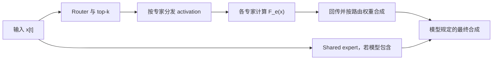
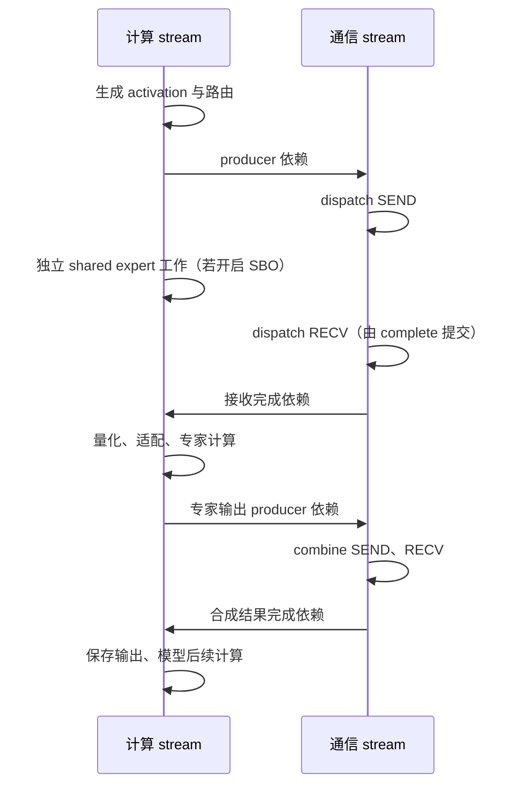

# SGLang、NCCL 与 MoE EP：从职责边界到执行机制

**面向读者：** 已熟悉 CUDA、异步执行与 SGLang Runtime，并看过 NCCL EP Python 接口，但还不能把接口调用与底层通信机制连起来的读者。本文从通信概念开始，帮助读者区分对象职责，追踪一次 AllReduce 和一次 MoE dispatch/combine，并分析正确性条件与性能成本。

**核心问题与结论：** SGLang 的一次分布式执行如何落实为设备工作，哪些条件保证 token 送对、算对、合对？理解这条路径需要同时追踪数据身份、对象关系、执行依赖和资源生命周期；性能判断则要结合有效工作量、关键路径及硬件资源，不能仅由单个接口或 kernel 的表现推出整体收益。

**范围与依据：** 本文为五个 Level 的原理教程，源码核对日期为 2026-09-24。SGLang 主线固定于 `a705747b5b82`，普通 NCCL 使用 2.30.7，NCCL EP 底层走读使用 nccl-extensions 的 `e57f0dad43dc`；完整版本和引用见附录 B。MoE 主线限定为 LL、expert-major、BF16 通信及 Triton FP8 专家计算；八 GPU 的 NVLink/RDMA 场景是教学设定，SM120 微架构分析另注明条件。数值推演和 CPU 算术校验不等同 GPU 验证；本文未执行多 GPU 通信或性能测试，引用的 PR 历史结果也未复测，所读源码不据此认定为历史 wheel 的实际构建来源。

**阅读导航：**[能力体系](#intro) → [职责边界](#level-1) → [对象拓扑](#level-2) → [动态数据流](#level-3) → [执行机制](#level-4) → [问题分析](#level-5) → [微架构、源码与术语附录](#appendices)

<a id="intro"></a>

## 引入｜读完后，你能够做什么？

学习终点是形成一条可检查的解释链：从 SGLang 的调用，说明数据交给谁、如何找到目的地、何时能够被消费，继而解释哪些实现条件决定正确性与成本。

```text
理解并分析 SGLang 中的 NCCL / MoE EP 执行
│
├── 解释执行：建立系统模型
│   ├── Level 1 · 职责边界
│   │   ├── 解释 MoE 怎样计算、为何需要通信
│   │   └── 判断各步骤由哪个组件负责
│   └── Level 2 · 对象拓扑
│       ├── 建立 token → expert → rank → GPU 的映射
│       └── 说明 NCCL communicator、EP group、EP handle 和存储的关系
│
├── 追踪实现：让模型对应实际代码
│   └── Level 3 · 动态数据流
│       ├── 追踪一次 AllReduce 怎样产生所有 rank 的结果
│       ├── 追踪一个 token 怎样送达、计算并合回原位
│       └── 指出位置、格式、身份与执行依赖的变化
│
└── 分析问题：从机制推导条件与成本
    ├── Level 4 · 执行机制
    │   ├── 将局部源码对应到线程、访存、同步和传输
    │   └── 推导可见性、复用条件和资源需求
    └── Level 5 · 正确性与性能推理
        ├── 定位可能失效的条件或关键路径
        └── 提出可验证假设，界定结论的适用范围
```

前两层回答“系统由什么组成”；第三层让这些对象运转起来；第四层拆开关键操作；第五层利用这些机制解释变化。阅读不需要先掌握通信术语，但默认你已熟悉 CUDA 和 SGLang Runtime，能读 Python、C++ 与 CUDA 源码。

### 两个问题贯穿全文

**问题一：普通 NCCL 如何完成一次 AllReduce？** 两台服务器各有四张 GPU，共八个 rank；节点内 NVLink，节点间 RDMA。每个 rank 对相同长度的 FP32 向量做 SUM AllReduce，分别考虑每个 rank 输入 4 KiB 与 64 MiB。为了能够手算，令 rank `r` 的每个输入元素都等于 `r+1`，于是每个输出元素应为 36。Ring 是我们选定的推演路径；没有运行记录时，不声称 NCCL 在这两个大小上一定选择 Ring。

**问题二：NCCL EP 如何让一个 token 送对、算对、合对？** 四个 EP rank，八个专家连续均分，top-k=2，本地 token 数为 `[0,16,32,64]`。追踪 rank 2 的 token 5：它选择 E1、E6，权重分别为 0.25、0.75。需要具体计数时，补全同一场景：其他 111 个 token 均选择 E0、E7；取发送容量 `C=64`、hidden size `H=4096`。这是一组人为指定的合法路由，用来让计数、偏移与容量可核算，不是模型的真实路由测量。

全篇对第二个问题使用 **LL、EXPERT_MAJOR、BF16 通信、接收后 FP8 量化、Triton 专家计算**这条路径。HT 与其他布局只在界定适用范围时出现。

<a id="level-1"></a>

## Level 1｜职责边界：MoE 为什么需要这些组件？

**本层结论：MoE 的计算目标决定数据必须送往哪些专家；专家放置决定其中哪些步骤需要跨设备通信。**

### 1.1 一个 MoE 层究竟算什么？

一个输入 token 在这里首先是一行 hidden activation：`x[t] ∈ R^H`。Router 产生专家分数，选择策略给出 K 个专家 ID 与相应权重。对本文的 routed 分支，可以写成：

\[
y_t^{routed}=\sum_{k=0}^{K-1}w_{t,k}F_{e_{t,k}}(x_t).
\]

`F_e` 是专家网络；在这条 gated SiLU 路径中，它包含 gate/up 投影、激活与逐元素乘法、down 投影。Router 的分数生成、top-k 选择和专家 GEMM 是不同步骤。模型还可能有独立 shared expert，其输出对当前 token 另行计算，再按模型规定与 routed 输出组合。



对追踪 token，目标是 `0.25·F₁(x₂,₅)+0.75·F₆(x₂,₅)`。若两个专家输出的第一个坐标分别是 4 和 12，这个坐标的 routed 结果就是 10。此例只指定输出以核算合成，不把专家简化成线性函数。

权重通常应作用在专家输出上。将输入改成 `w·x` 再执行非线性专家，一般不能保持 `F(w·x)=w·F(x)`。因此“在何处乘权重”是数据契约的一部分。所研究的 Triton 适配禁止 `apply_router_weight_on_input`，实际路由权重保留给 NCCL EP combine。[Triton 适配源码][s-triton]

### 1.2 专家分布到不同 GPU 后，增加什么工作？

**Expert Parallelism（EP）**把专家集合分给一组执行参与者。本文先采用常见的一进程一 GPU 映射，每个 rank 拥有两个完整专家。Rank 是它在某个通信组内的编号；同一 GPU 在另一组中的编号可能不同。

源 rank 拥有 token，并不意味着它拥有该 token 选中的专家。Rank 2 拥有 E4、E5，但 token 5 要去 E1、E6，因此执行需要三件事：

1. **Dispatch：**依据路由，把 activation 及必要身份信息送至拥有目标专家的 rank，并准备专家能使用的布局。
2. **Expert compute：**在目标 rank 对各专家收到的有效行执行其网络。
3. **Combine：**把结果关联回原始 token，完成回传与加权合成。

输入 token 只有 112 个，token–expert 计算关系却有 `112×2=224` 条。路由复制是逻辑关系；物理通信可以对同一目标 rank 去重，不能把路由条数直接当作网络消息数。第 4 层会给出这一路径的具体实现。

Rank 0 没有自己的输入 token，但持有 E0、E1，仍要接收远端工作并返回结果。**本地请求为空只约束本地最终输出，不决定本地专家有没有工作。**

### 1.3 通信操作描述什么结果？

一个 **NCCL communicator** 建立一组参与者的通信上下文。**Collective** 是这组参与者共同完成的操作；每个 rank 的调用必须在参与者、操作顺序及对应参数上匹配。通信对象是 tensor 中的数值，NCCL 不知道这些数值在模型里叫 token 还是梯度。

| 操作 | 输入与输出关系 | 在本文中的用途 |
|---|---|---|
| Send / Recv | 指定参与者之间发送与接收 | 理解一条传输边 |
| Broadcast | 根 rank 的数据提供给组内参与者 | 建立“谁拥有结果”的概念 |
| Reduce | 按 SUM 等规则归约，指定 rank 得到结果 | 建立归约语义 |
| AllReduce | 对应位置归约后，每个 rank 都有完整结果 | 问题一的目标 |
| ReduceScatter | 先归约，结果按 rank 分片保留 | Ring AllReduce 的前半部分 |
| AllGather | 收集每个 rank 的分片，所有 rank 得到完整集合 | Ring AllReduce 的后半部分 |
| All-to-All | 各 rank 给不同目标发送不同数据 | 理解 EP 的交换关系；不限定其实现 API |

SUM AllReduce 满足 `y_r[i]=Σ_q x_q[i]`。其中 AllReduce 规定结果分布，SUM 规定归约规则。ReduceScatter 再接 AllGather 可以实现这一数学目标，但具体 NCCL kernel 能把相邻步骤融合，不要求用户提交两次 API。[通信语义][n-collectives]

MoE dispatch 包含不规则目的地、身份映射和布局转换，未必通过一个普通 All-to-All API 实现。后续我们将直接追入 EP 的设备端通信。

### 1.4 各组件分别负责什么？

| 组件 | 本次工作中的责任 | 它需要交付给下一层的东西 |
|---|---|---|
| SGLang Runtime | 组织当前 forward、CUDA Graph、bucket 和批次执行 | 本轮张量及执行上下文 |
| 模型层与路由逻辑 | 按模型定义生成路由、组织 shared/routed 分支 | activation、expert IDs、权重 |
| MoE dispatcher | 接入 dispatch/combine，衔接输入输出格式和生命周期 | 专家输入、有效计数、可回传结果 |
| MoE compute backend | 执行本地专家网络 | 与接收身份一一对应的专家输出 |
| Python binding | 把对象与参数连接到 native API | descriptor、native 指针、stream |
| NCCL / NCCL EP native | 管理通信资源，组织协议及设备工作 | 满足通信与布局契约的数据 |
| GPU kernel、互联与 NIC | 执行索引、搬运、归约、同步及物理传输 | 可被后续消费者读取的结果 |

Backend 与 Runtime 在 stream、CUDA Graph 和资源复用处相接；“具体算子实现”也有执行和生命周期责任。一个模型使用的通常是 backend 组合：选择 NCCL EP 并不替代专家 GEMM backend，也不决定 attention 的实现。[接入路径][s-dispatch]

**本层自检：**如果把 NCCL EP 换成另一种通信 backend，专家函数与 MoE 数学目标可保持不变；需要重新确认的是路由、布局、数值格式和执行契约是否兼容。

<a id="level-2"></a>

## Level 2｜对象拓扑：这些职责由什么承载？

**本层结论：必须同时画清参与者映射、软件对象关系和资源所有权，才能判断数据会去哪里、对象能否共享。**

### 2.1 token、expert、rank 与 GPU 的映射

对本文连续均匀放置，`L=E/W=2`，global expert `g` 的目标 rank 为 `g//L`，local expert 为 `g%L`。这是选定布局的映射，不适用于所有动态专家放置策略。

| EP rank | 对应设备（本例） | 本地输入 token 数 | 拥有的 global experts |
|---|---|---:|---|
| 0 | GPU 0 | 0 | E0、E1 |
| 1 | GPU 1 | 16 | E2、E3 |
| 2 | GPU 2 | 32 | E4、E5 |
| 3 | GPU 3 | 64 | E6、E7 |

token 身份至少需要 `(源 rank, 源行号)`；一条路由进一步带上 top-k 位置 `k`。本例中的 `(2,5,0)` 去 rank 0 的 local expert 1，`(2,5,1)` 去 rank 3 的 local expert 0。

TP 表示一个计算被 tensor 分片共同执行，DP 表示数据工作在组间分配，EP 表示专家分布。它们可以重用参与者，但编号与责任要分别追踪。指定 PR 栈的配置校验将 NCCL EP 解析为 `EP=TP`，这是该接入路径的配置约束，不是 EP 的数学定义。[配置校验增量](https://github.com/Laceprndpm/sglang/commit/50ecc92553e91fdd850001e0f05b9936e4b44da8)

### 2.2 NCCL communicator、EP group 与 EP handle 的关系

SGLang 取得已有 NCCL communicator，将其包装后传给 `nccl.ep.Group.create`，创建 EP group。[对象创建源码][s-dispatch]

| 对象 | 实际负责的内容 |
|---|---|
| NCCL communicator | rank 身份、通信参与者与底层通信连接 |
| EP group | EP 配置、共享通信缓冲区、收发进度、通知资源和缓冲区轮换状态 |
| EP handle | 当前路由的引用、token↔专家 slot 映射、布局信息和等待 `complete()` 提交的后续操作 |
| SGLang 分配的 tensor | 输入、专家接收输出、`expert_counters` 和最终 combine 输出等 |

源码依据：[EP group 与 EP handle 的定义][ep-host]、[SGLang tensor 分配][s-dispatch]。

```text
NCCL communicator
  + EP 配置：专家数量、通信模式、token 容量
  + EP 共享通信资源：传输缓冲区、通知资源
  + 共享协议状态：收发进度、缓冲区轮换状态
  = EP group

EP group
  + 当前路由的引用：top-k 专家 ID、token 数、top-k 数
  + 数据布局信息
  + 本次路由的映射：原 token ↔ 专家接收 slot
  + 本次操作的阶段状态：等待 complete() 提交的后续操作
  = EP handle
```

对于普通 collective，PyTorch 的 `ProcessGroupNCCL` 和 SGLang 的 `PyNcclCommunicator` 是两种上层入口。后者的 `all_reduce` 可以直接到 native `ncclAllReduce`；不能把两者及 `nccl4py` 强行串成每次调用必经的三层。[PyNccl 入口][s-pynccl]

### 2.3 实际存储、有效范围与身份

定义 `T_r` 为本轮源 token 数，`C` 为每 rank 发送容量，`M=W·C` 为每个本地专家预留的接收行容量。指定路径的主要数据如下。

| 对象 | shape / 类型 | 读者必须知道的含义 |
|---|---|---|
| `hidden_states` | `[T_r,H]`，BF16 | 原始 token-major activation |
| `topk_ids` | `[T_r,K]`，int64 | global expert IDs；CUDA Graph 路径中的无效行可用 -1 |
| `topk_weights` | `[T_r,K]`，FP32 | 源 token 的合成权重 |
| `recv_tokens` | `[L,M,H]`，BF16 | 接收后 expert-major 存储 |
| `expert_counters` | `[L]`，int32 | 每个专家实际有效行数 |
| FP8 专家输入 | `[L,M,H]` | 接收后量化结果 |
| group scales | `[L,M,H/128]`，FP32 | 每行每 128 个 hidden 元素的缩放 |
| 专家输出 | `[L,M,H]`，本路径为 BF16 | 与接收 slot 对应的专家结果 |
| `combined` | 分配 `[C,H]`，返回 `[:T_r]` | 恢复 token-major 的本地输出 |

`M` 是容量，counter 是本轮有效范围。对补全路由，E0、E1、E6、E7 的计数为 `111,1,1,111`，其余为 0。Rank 0 的两项 counter 是 `[111,1]`，但分配的接收 shape 仍是 `[2,256,4096]`。BF16 接收区占 4 MiB，FP8 区占 2 MiB，FP32 scales 占 64 KiB。分配量不能直接当成通信量或 GEMM 运算量。

返回对象中的 `expected_m` 是估计量；决定有效行的是实际 counter。特别是在本地 token 数不均匀时，不能拿一个平均估计替代收到的数据量。

SGLang 还分配 `expert_offsets` 和 `recv_total` 并传入 `LayoutInfo`。在所选 native LL dispatch 分支，计算消费直接依赖的是 `expert_counters`；不能因为字段存在就假设它包含有效 compact 前缀和。`ncclEpUpdateHandle` 的 HT 预处理路径会处理 offsets/total，而当前 SGLang 的 LL 调用没有据此组织专家计算。[SGLang 存储分配][s-dispatch]、[native metadata 与 dispatch][ep-host]

最关键的身份关系是：

```text
(source_rank, token_row, topk_position)
       → 传输暂存区里的 token slot
       → (local_expert, expert_receive_slot)
       → expert_output_slot
       → (original_token_row, topk_position)
       → combined[original_token_row]
```

传输 slot 与专家接收 slot 是两个不同索引。第 4 层会给出 source-info 表的实际偏移；现在先保留它们之间需要显式映射这一事实。

### 2.4 Graph executable 与分批执行如何改变对象关系？

**Graph executable 是可重放的 CUDA 执行图，它引用的资源必须持续有效；子批重叠执行还要求各自使用的状态和缓冲区相互隔离。** 一次 MoE 执行需要 EP group、EP handle、输入与路由存储，以及接收和 combine 暂存区。Graph executable 会反复重放引用这些资源的设备工作，因此不能在捕获后就释放它们。

串行执行时，相容的 MoE 层可以依次借用同一套资源。如果启用 TBO（Two-Batch Overlap，将批次拆为两个子批并交错执行），子批 0 尚未用完的路由、接收数据和 EP handle 状态，就可能被子批 1 覆盖。因此该实现为两个子批分别准备一套资源。

**本文将一个子批独立使用的 EP 资源集合称为 EP lane**，对应源码中的 `_NcclEpGraphLane` 类。它不是 CUDA 中的 warp lane，也不是一条物理通信链路。[EP lane 实现][s-graph]

```text
串行执行：各层依次使用 EP lane 0

TBO 交错执行：
  子批 0 → EP lane 0：EP group 0 + EP handle 0 + 输入/路由/接收/输出暂存
  子批 1 → EP lane 1：EP group 1 + EP handle 1 + 输入/路由/接收/输出暂存
```

**EP 资源管理对象**统一管理这些 EP lane，对应源码中的 `NcclEpGraphResources` 类。本文将一批共同建立、共同退役的捕获结果及其配套资源称为一个 **generation**。相关 Graph executable 由 CUDA Graph 执行后端管理，退役时需要与 EP 资源管理对象协调。

CUDA API 使用 `cudaGraphExec_t` 标识 Graph executable。一个 Graph executable 可以包含两个子批的工作；每个 EP lane 则各有一个 EP handle。Graph executable 与 EP handle 是不同对象，二者不是类的继承关系。

实际对象持有关系与执行图中的工作关系应分别画：

```text
Python 对象持有关系：
CUDA Graph 执行后端（FullCudaGraphBackend）
  ├─ _graphs[shape_key]：该形状的 Graph executable（由 torch.cuda.CUDAGraph 包装）
  └─ _nccl_ep_resources：EP 资源管理对象
       ├─ EP lane 0 → EP group 0、EP handle 0、buffers 0
       └─ EP lane 1 → EP group 1、EP handle 1、buffers 1

一个选定 Graph executable 内的设备工作（依赖示意）：
  子批 0：dispatch 0 → expert compute 0 → combine 0
  子批 1：dispatch 1 → expert compute 1 → combine 1
```

Capture 时，两个子批在相关 stream 上提交的设备工作及依赖共同被捕获，形成一个 Graph executable；replay 时，后端对选定 `shape_key` 调用一次 `.replay()`。因此可以在同一次 replay 中让子批 0 的 expert compute 与子批 1 的 dispatch 重叠，前提是捕获的依赖允许且硬件资源可用。Graph executable 内的节点使用各 EP lane 对应的存储和通信状态；replay 不重新调用 Python 的 `handle.dispatch()` 来分别启动两个 EP lane。多个形状的 Graph executable 也可以在本实现的串行提交约束下复用这批持久资源，因此不宜把 EP lane 画成某一个 Graph executable 独占的子对象。[捕获与重放实现][s-full-graph]

同一 EP lane 可由不同层串行借用，但不能同时改写 EP handle 的阶段状态或 recv 暂存区。即使通信事务结束，逻辑输出仍可能被后续节点读取；`combined.clone()` 为它保留独立存储，避免下一层复用 combine 暂存区时覆盖旧结果。

三个条件分别检查：**storage 仍存在，producer 的写入已对 consumer 有效，新 writer 尚未覆盖旧 consumer 所需内容。** 保留 Python 引用、建立 stream 依赖和隔离复用范围，分别解决不同部分。

销毁按依赖逆序进行：停止提交并完成在途工作，退役依赖资源的 Graph executable，再释放 EP handle、EP group 和相关存储。重建时产生新 generation，旧 Graph executable 不能继续引用新旧混杂的状态。

**本层自检：**rank 0 的输出 shape 是 `[0,H]`，为什么仍需要接收区、EP handle 和专家权重？因为本地输出归属和远端专家服务是两条独立关系。

<a id="level-3"></a>

## Level 3｜动态数据流：一次调用如何走完？

**本层结论：把 API、对象和 buffer 接成执行链，才能知道某个函数返回后下一步究竟可以做什么。**

### 3.1 问题一：普通 NCCL 如何完成一次 AllReduce？

#### 从入口到设备工作

以 SGLang 的直接 NCCL 入口为例，`PyNcclCommunicator.all_reduce` 取得 tensor 指针、元素数量、dtype、归约规则和当前 CUDA stream，调用 native `ncclAllReduce`。这里已经建立 NCCL communicator；初始化的参与者发现、拓扑探测和连接建立，不应再次算入每次稳态 AllReduce。

固定版本中的源码导航为：

```text
SGLang PyNcclCommunicator.all_reduce
    ↓
NCCL collectives.cc: ncclAllReduce
    ↓  构造操作描述
enqueue.cc: ncclEnqueueCheck / 任务准备
    ↓
成本表与 topoGetAlgoInfo：选择 algorithm / protocol / 并行度
    ↓
scheduleCollTasksToPlan / calcCollChunking：计划与分块
    ↓
group.cc + ncclLaunchKernel：协调提交设备工作
    ↓
device/all_reduce.h: 选定 specialization，例如 runRing
    ↓
protocol primitives + 已建立的 transport
    ↓
接收结果及其后续 stream 消费者
```

这是源码导航图，省略包装函数和分支，不表示所有名字构成一条逐层直接调用栈。实际选择依赖拓扑、消息大小、配置与支持条件；本层接下来固定 Ring 以便推演。[Python 入口][s-pynccl]、[native API][n-collectives-cc]、[任务计划与选择][n-enqueue]、[提交组织][n-group]

#### 先选一条 ring，再追一块数据

设逻辑 ring 顺序为 `0→1→2→3→4→5→6→7→0`，并将每个输入等分为八块。为了与 `runRing` 的索引一致，本例让 rank 1 先发送 chunk 0，沿环累加，最终 rank 0 得到归约完整的 chunk 0。

| 传输边 | 发送时 chunk 0 的一个元素 | 接收方加入本地元素后的值 |
|---|---:|---:|
| 1 → 2 | 2 | 2+3=5 |
| 2 → 3 | 5 | 5+4=9 |
| 3 → 4 | 9 | 9+5=14 |
| 4 → 5 | 14 | 14+6=20 |
| 5 → 6 | 20 | 20+7=27 |
| 6 → 7 | 27 | 27+8=35 |
| 7 → 0 | 35 | 35+1=36 |

其他七块同时按相同结构、不同起点推进。ReduceScatter 完成后，rank `r` 拥有归约完成的 chunk `r`。随后 chunk 0 从 rank 0 向 1、2……7 传播；各 rank 保存它，并继续转发，最终每个 rank 都有八块完整结果。

这张表描述一个 chunk 的依赖顺序，不是八个 rank 轮流独占设备。具体 kernel 可以让多块、多 channel 流水执行，归约完成与下一阶段发送也可以融合。[Ring 实现][n-ring]

#### 为什么 4 KiB 和 64 MiB 的成本不同？

设每个 rank 输入 N 字节，P=8。理想等分 Ring 每个 rank 的单向发送 payload 是：

\[
B_{send}=2\frac{P-1}{P}N=1.75N.
\]

| 每 rank 输入 | 每块大小 | 每 rank 发送 payload | 每 rank 接收 payload |
|---|---:|---:|---:|
| 4 KiB | 512 B | 7 KiB | 7 KiB |
| 64 MiB | 8 MiB | 112 MiB | 112 MiB |

这些数不含协议字段、对齐和重传，也不是每个 NIC 必然经过的字节数。在所画 ring 中，`3→4` 与 `7→0` 跨节点，其他边在节点内；真实 NCCL 可使用多个 ring 或其他算法，网络流量需要按实际拓扑重新统计。

小消息每步有效数据少，提交与同步更容易占主导；大消息更依赖持续供给和有效带宽。这个推导解释成本权重，不能推出固定的算法或协议切换阈值。

### 3.2 问题二：token 5 如何送对、算对、合对？

#### 送对：从源行到专家有效行

`dispatch_a` 将路由转换为该接口使用的 int64 IDs 和 FP32 weights，准备 EP handle 与固定接收区，清零有效计数，再提交 send-only dispatch。此时 activation 为 BF16，FP8 量化尚未发生。

在 native 发送阶段，token `(2,5)` 的两个目标 rank 为 0、3；分别分配传输 slot，把 token ID 与路由信息随 activation 送达。接收阶段发现目标 local expert 后，为对应 expert 分配有效行，并保存反向映射。我们把两边分配到的专家 slot 分别记为 `s₁`、`s₆`；除非读取实际执行中的计数与映射，不能先给它们指定固定数值。

```text
rank 2: x[5], ids[5]=[1,6], weights[5]=[0.25,0.75]
       ├── rank 0 → local expert 1 → recv[1,s₁,:]
       └── rank 3 → local expert 0 → recv[0,s₆,:]
```

`dispatch_b` 提交接收 continuation，随后按正确 stream 依赖量化有效行。返回的 `DeepEPLLDispatchOutput` 是 SGLang 复用的输出格式名，并不说明通信由 DeepEP 执行。[dispatch 两阶段][s-dispatch]

#### 算对：按有效行与正确专家执行

对完整路由，计数应满足：

```text
rank 0: E0=111, E1=1
rank 1: E2=0,   E3=0
rank 2: E4=0,   E5=0
rank 3: E6=1,   E7=111
总计 = 224 条 token–expert 关系
```

Triton 适配把有效 FP8 slot 反量化到 BF16 中间区，给每行构造 local expert ID；无效行使用 `-1`，中间权重设为 1。随后通用 FP8 fused-experts 路径执行量化与两次 GEMM。这里的 1 是计算适配用的占位权重；0.25 和 0.75 仍保存在原始路由权重中，等待 combine。[适配与计算入口][s-triton]、[通用专家执行][s-fused]

#### 合对：恢复原 token，而不是按专家存储顺序拼接

`combine_a` 提交专家输出与源 token 权重。Native 利用 dispatch 产生的 source-info，找到 `s₁`、`s₆` 对应的原 token 5 和 top-k 位置；分别送入源 rank 的两条结果 slot。接收阶段读取对应权重，累加后写回 `combined[5,:]`。最后 `combine_b` 提交接收与合成的后半段工作，并处理输出所有权。

对第一个输出坐标，`0.25×4+0.75×12=10`。Rank 0 仍返回 `[0,H]` 的本地输出，但它计算出的 E0/E1 结果已经送给其他源 rank。若模型含 shared 分支，它在模型层与 routed 结果合成；还应检查 routed scaling factor 是否已经融合进 top-k，避免重复缩放。[模型合成][s-model]、[native combine][ep-device]

### 3.3 分阶段通信与结果就绪

**分阶段通信（staged）在本文中指同一次 dispatch 或 combine 分成 A、B 两次提交：A 提交发送阶段，B 通过 `complete()` 提交接收处理阶段。** 前面出现的 `dispatch_a/b`、`combine_a/b` 就是这组接口。[SGLang 阶段入口][s-dispatch]

| SGLang 阶段 | 对应工作 |
|---|---|
| `dispatch_a` | 准备资源，调用 `dispatch(send_only=1)` 提交 SEND 阶段 |
| `dispatch_b` | 调用 `complete()` 提交 RECV 阶段，再按依赖提交接收后量化 |
| `combine_a` | 调用 `combine(send_only=1)` 提交专家结果回传的 SEND 阶段 |
| `combine_b` | 调用 `complete()` 提交 RECV 与合成阶段，处理输出所有权 |

这里的 RECV 阶段包含等待就绪、读取传输暂存区、布局整理或加权合成。它并不意味着“调用 B 之前，远端字节一定还没有到达”：远端写入可能已经发生，但下游需要的是本次操作处理完毕的有效输出。

**`complete()` 在这个 LL 实现中是“补交后半段工作”的入口。其 host 返回既不等于全设备同步，也不自动结束所有资源的使用期。** 因此，消费者能够安全读取结果的依据是设备执行依赖，而不是 Python 已经调用过 `complete()`。

原生实现把“以后如何提交后半段”的函数保存在 **EP handle** 中，这个保存下来的后续操作称为 **continuation**。具体地，`ncclEpDispatch` 创建一个携带本次参数的函数对象（闭包），先用 SEND phase 调用它，再放入 EP handle 的 `continue_fn`。`ncclEpComplete` 用 RECV phase 调用这个函数，成功后清空槽位。Combine 使用同一个槽位，因此不能在 dispatch 的后半段尚未提交时，用新的 send-only combine 覆盖它。[continuation 实现][ep-host]

源代码中闭包还捕获提交时的 stream 和 descriptor 指针。`complete` 形参中的 stream 不能被想当然地当作迁移 continuation 的手段。SGLang 的通信 stream 封装让 send 和 complete 进入同一通信 stream，再让 consumer 等待它。[stream 封装][s-stream]



这是所需依赖图，host 实际提交顺序还影响是否有足够工作重叠。`complete` 端没有再次等待 send 与 complete 之间提交的全部计算工作；否则会人为增加“shared compute → receive”的边，使本可重叠的工作串行。

Descriptor 的生命周期至少覆盖 native continuation 对它的 host 访问；tensor storage 则覆盖实际 GPU 使用及后续消费者。SGLang 把 `inputs/outputs/layout_info` 保存在阶段状态中，同时通过 stream 依赖和 allocator 记录处理设备使用期。二者缺一不可。

### 3.4 同一 Graph executable 再次重放时，token 换了专家，会发生什么？

**Graph executable 重放的是固定的设备工作与依赖；这些工作仍会读取本轮路由，并据此产生新的接收布局和结果。** 用同一个 token 的变化，可以检查这条动态数据流是否真正连通。

保持原场景的输入形状、容量和其他 token 路由不变，只把 rank 2 的 token 5 从 `[E1,E6]` 改为 `[E0,E7]`，权重仍为 `[0.25,0.75]`。假设上一轮使用相关存储的工作已经结束，本轮仍满足同一 Graph executable 的运行条件。

| 追踪位置 | 上一轮 | 本轮应发生的变化 |
|---|---|---|
| 路由存储中的 token 5 | `[1,6]` | 同一存储位置写入 `[0,7]` |
| Dispatch 的目标 | rank 0 的 E1、rank 3 的 E6 | rank 0 的 E0、rank 3 的 E7 |
| 专家有效计数 | E0/E1/E6/E7 为 `111/1/1/111` | 变为 `112/0/0/112` |
| Token 5 的接收映射 | 指向 E1、E6 的有效行 | 本轮重新分配 E0、E7 的行并保存映射 |
| 专家计算与 combine | `0.25F₁(x)+0.75F₆(x)` | `0.25F₀(x)+0.75F₇(x)` |

这次变化有一个容易漏掉的地方：**目的 rank 仍然是 0 和 3，变的是它们内部的目标专家。** 只看到数据仍在这两个 rank 之间传输，不能证明路由更新正确；还需要核对 local expert、counter 和回传映射。

沿执行顺序看，新的路由先由上游计算产生，再通过捕获的复制操作写入 EP handle 引用的固定路由存储。Dispatch kernel 随后读取这些新值，生成本轮计数与映射；专家计算依据本轮有效行执行；combine 使用本轮映射恢复 token 5 的输出。Replay 不需要重新执行 Python 的 EP handle 创建或 dispatch 调用。[固定路由存储与复制][s-graph]、[设备端读取与映射][ep-device]

E1、E6 的接收区可能还残留上一轮的数据，但本轮 counter 已经为零，这些旧行不能被当成有效输入。对 E0、E7 而言，token 5 的接收 slot 也不必沿用上一轮的编号：正确性要求是本轮映射贯穿计算和回传，而不是 slot 编号永远固定。

因此，追踪一次 replay 应核对“新路由写入 → 新计数与映射 → 对应专家计算 → 本轮输出”这条链。若输出仍是旧专家的结果，就沿链寻找最早没有更新的环节。第 4 层再进入 kernel，解释映射和状态具体如何更新。

**本层自检：**拿到一个错误输出时，能否指出它对应的源行、top-k 位置、专家 slot、原始权重及各阶段依赖？只会列出 dispatch、GEMM、combine 三个名字还不足以追踪这个错误。

<a id="level-4"></a>

## Level 4｜执行机制：关键局部如何落实为硬件工作？

**本层结论：设备端的索引、同步和资源分配共同实现上层契约。以下剖析以源码中可见的局部为单位，不把 PR 描述替代为指令级证据。**

本层 EP 内部结论均指 `nccl-extensions@e57f0dad43dc` 的 LL expert-major BF16 路径；与 SGLang 的连接依据是输入输出和调用契约。普通 NCCL 使用独立固定的 2.30.7 源码。NCCL 的 `Simple/LL/LL128` 是协议族，EP 的 `LOW_LATENCY` 是 EP 算法模式，两者名字中的 LL 不能用于推断实现相同。

### 4.1 AllReduce：算法、分块与协议怎样成为 kernel？

#### 结论：一个 collective 被拆成可流水的工作，归约可以与搬运融合

四个维度共同描述同一次通信：algorithm 决定参与者交换与归约的组织；protocol 决定 payload 和同步状态如何推进；transport 决定连接通过什么机制实现；channel 用于划分并行通信工作。它们分别回答不同问题，channel 也不是 CUDA stream。

#### 源码与索引：`runRing` 的五类 primitive

`runRing` 从 `ncclCollCbdPart` 取得当前 channel 的起点、元素数和 chunk 大小。一个循环处理 `P·chunkCount` 个元素，尾部按剩余量重新计算 chunk，并进行必要对齐。以逻辑 ring index `i` 表示当前参与者，其动作可概括为以下教学伪代码：

```text
发送 chunk(i-1)
对 chunk(i-2), ..., chunk(i-(P-1))：接收 + 本地归约 + 转发
对 chunk(i)：接收 + 最后一次归约 + 保存 + 转发
对后续完整 chunk：接收 + 保存 + 转发
对最后一块：接收 + 保存
```

对应源码中的 `directSend`、`directRecvReduceDirectSend`、`directRecvReduceCopyDirectSend`、`directRecvCopyDirectSend`、`directRecv`。中间 primitive 同时具有数据搬运和数值计算责任，因此不能把通信 kernel 的所有耗时都算作链路搬运。Primitive 名称中的 `direct` 也不足以证明数据一定绕过某个暂存区；还要看实际协议 specialization 与连接 flags。[Ring kernel][n-ring]

其中结束归约阶段的实际调用是：

```cpp
prims.directRecvReduceCopyDirectSend(offset, offset, nelem, /*postOp=*/true);
```

两个 offset 分别连接本地输入与输出位置，`nelem` 限定当前块的有效元素；`postOp` 让需要最终处理的归约规则在完整归约处执行。该调用同时衔接保存结果与传播结果。

#### 内存与同步：经典 LL 的一条 line

`prims_ll.h` 的接收局部读取四个 32-bit 字段：

```text
data₀ | flag₀ | data₁ | flag₁
 4 B     4 B     4 B     4 B
```

可见的 PTX 形式是 `ld.volatile.global.v4.u32`；接收线程持续读取，直到两项 flag 都等于本 step 的期望值，再拼出 64-bit payload。发送使用对应向量化 store。单条 line 的 16 B 中有 8 B payload，这是该结构的编码开销，不是整条链路实际利用率，更不是 EP LL 的传输效率。[LL primitive][n-ll]

FIFO 地址由 `step % NCCL_STEPS` 选择；发送侧通过 head/credit 判断是否有可复用位置，接收后推进 head。仅保证“此次数据写到另一块地址”不够：绕回时还必须避免覆盖尚未消费的旧 step。Flag 的循环与清理也属于协议正确性。

`volatile` 保证相应访问按该指令语义发生，不能独立证明完整跨 GPU 发布协议。证据链还包括连接内存的可访问性、生产者写入、flag/credit 顺序及对应 transport 的推进。

#### 硬件成本与边界

线程轮询会占用执行资源；编码字段、对齐与 chunk 尾部增加额外流量；增加 channel 可能增加并行供给，也会增加执行与控制成本。对 4 KiB 输入，拆得过细可能让每份有效工作太小；对 64 MiB，供给不足则可能无法维持带宽。这解释需要测什么，并不预设“channel 越多越好”。

### 4.2 EP：怎样真实编码身份、分配 slot 并完成回传？

#### 结论：前向保存显式映射，回传使用原始 token 与 top-k 位置寻址

Native dispatch 的 expert-major 接收 slot 由原子计数分配；combine 通过 source-info 恢复原路由。我们可以把第 2 层中的抽象映射展开成具体索引。

#### 发送：按目标 rank 去重并分配传输 slot

发送 kernel 从 `inTopkIdx[t*K+k]` 计算目标 rank。多个选中专家若属于同一目标 rank，只让其中第一个 top-k 位置对应的 warp 发送 activation。目标端 header 仍保留完整路由，因此接收时能够展开为多个专家输入。

对每个目标 rank `d`，发送侧用 `atomicAdd(rankSentCnt+d,1)` 分配传输 slot `u`。这个 u 只表示当前源 rank 发给 d 的第几份消息，不能当成原 token 行号 t。源 token 行号另写在 header 里。

传输暂存按源 rank 分区。网络路径中每条记录为 `[header | payload | scales]`；所选版本的同 LSA 路径将 header 与 payload 分区放置。两种暂存格式最终都被转换为相同 expert-major 输出。[发送与接收实现][ep-device]

#### 接收：分配专家行并建立反向表

用 `r` 表示源 rank、`u` 表示传输 slot、`e` 表示 local expert、`s` 表示专家接收 slot，则核心关系可写为：

```text
s = 原子递增 expert_counter[e] 所返回的旧值
q = e * (W*C) + s                      # expert-major 展平行号
b = W + (r*C + u) * (K+1)              # source-info 中该消息的起点
source_info[b]     = header.token_id   # 原始 t
source_info[b+1+k] = q                 # 非本地 top-k 记为 -1
recv_flat[q,:]    = message_payload
```

这是按源码重写的索引伪代码。表的前 W 项还保存来自各源 rank 的消息数量；本地所有 source 的某个 expert 共同更新同一 counter，因此有效 expert 行形成 `[0,count[e])`。原子分配确保不重复占用行，但到达顺序不同可能改变 slot 排列。

对应的两条实际源码语句位于 warp lane 0 的分配分支：

```cpp
recvTokenBeginIdx = atomicAdd(outCnt + localExpertIdx, 1);
recvSrcTopkInfo[topkIdx] = outDataOffset + recvTokenBeginIdx;
```

同一 warp 的其他 warp lane 随后通过 shuffle 获得这个 slot，协作复制 hidden 维数据。原子操作分配行，shuffle 传播分配结果，二者承担的职责不同。

对 token `(2,5)`，rank 0 保存 top-k 位置 0 的展平行 `256+s₁`，rank 3 保存位置 1 的行 `s₆`。必须读取 source-info 才能知道实际 s；此前常见的猜测 `s=r*C+t` 不符合这里的 expert-major 分配方式。

#### Combine：临时区恢复 top-k 位置，再做数值合成

Combine send 读取 source-info，取得专家输出展平行 q、原 token t 和 top-k 位置 k。BF16、无额外 combine 量化的固定源码分支按下式选择返回暂存位置：

\[
\text{return byte offset}=(tK+k)\,B_{slot}.
\]

这个版本的 NONE recipe 保留 metadata 尾部，因此 `B_slot=2H+4·H/128`，H=4096 时为 8320 B；它不是只包含 8192 B activation 的数学向量长度。是否每条物理路径发送全部尾部，仍应继续看实际 send 的字节数，不能用 slot stride 代替传输计数。[combine 寻址与 slot 格式][ep-device]

token 5 的两份结果对应 slot 10、11，其字节起点为 83,200 和 91,520。接收阶段的 TMA load warp 将所需数据搬入 shared memory；reduction warps 读取原始 `topkWeights[5,k]`，以 FP32 累加，再写目标 dtype。权重在这里生效，专家计算适配中的占位权重 1 不会再次改变它。

这也解释了为什么输出必须与输入专家 slot 对齐：若 compute 为了提高 GEMM 效率重排了行，就必须在回传前恢复这一对应，或同时更新 combine 使用的映射。

#### 分阶段通信的完成与 Graph executable 的动态状态

Host `continue_fn` 只在提交/capture 时发挥作用。Graph executable 的 replay 重放捕获的 SEND/RECV kernel，不重新调用 Python `complete()`。在本 native 快照中，`ncclEpUpdateHandle` 的 LL 分支更新并持有路由 descriptor，而 dispatch kernel 每轮读取其数据指针里的路由值、重新生成计数和 source-info。

设备侧 `LowLatencyEpochState` 保存 `epoch/pending_epoch/send_in_flight`；bank 由 `epoch & 1` 决定。SEND-only 记录 pending epoch，RECV-only 取回它并推进 epoch；双 bank 提供跨阶段的存储组织。因而这里的动态路由和 bank 推进都有设备工作依据，不只依赖“地址固定”这一事实。[EP handle 更新与 continuation][ep-host]、[epoch 与设备映射][ep-device]

双 bank 不授权两个事务任意并发。该实现的一个 pending 状态、复用的 counter 和 EP group 的 workspace 仍施加序列化条件；TBO 要额外提供独立 EP lane 资源。

#### 成本与适用范围

前向原子分配、header 解析、payload 打包和从传输区到 expert-major 区的复制都有代价。发送按 rank 去重可能减少 activation 的物理重复，但专家计算关系仍有 K 份。本节公式只适用于选定的 LL expert-major 实现，不能移植到 rank-major 或 HT 后继续使用。

### 4.3 物理传输：谁发起、谁搬运、谁消费？

#### 结论：地址可访问、数据发布和消费者可读是三件要分别证明的事

先分配 GPU memory，再通过注册、窗口和 peer 映射建立远端访问能力，最后由协议及执行依赖保证内容有效。分配成功不代表 NIC 已可访问；获得 peer pointer 也不代表本轮数据已经到达。

#### 同 LSA 路径

`ncclGetP2pPtr` 检查目标是否属于本设备的 **LSA（load/store accessible）team**，然后从窗口取得 peer pointer。发送 warp 可以通过该地址执行 payload store；接收方经过同步后读取暂存区并打包到专家布局。

```text
源 SM：读取 activation → 发出 peer memory store
    → 实际 NVLink / PCIe 路由
    → 目标设备内存地址
    → 接收 kernel：等待发布条件 → 读取与布局转换
```

源码里的 `isNvlinkSrc`、`kNvlinkOnly` 等名称不能取代物理拓扑证据：这里判断的关键条件是 LSA team 成员关系。对于 SM120 的 PCIe peer-access 部署，应按实际 PCIe 路径分析，而不是因为变量名中出现 NVLink 就画出 NVLink 链路。[peer pointer 与分支][ep-device]

完成通知也不只是“写一个 bool”。发送侧通过本地完成计数汇聚 payload 工作，再对 peer 计数执行 system-scope release store，编码为 `-(n+1)`；接收端 acquire load 等待非零并恢复 n。n=0 时仍有非零通知，所以零 payload 也能表达“这一来源已经交代完毕”。

这条实际通知语句展示了编码和发布操作如何结合：

```cpp
st_release_sys_global(reinterpret_cast<int*>(dstP2pPtr), -numTokensSent - 1);
```

#### 跨 LSA / 网络路径

选定 EP 代码对网络路径构造 `ncclGin`，用 `net.put` 提交源窗口、目标窗口、偏移与字节数。GPU 发起请求，NIC 执行网络数据搬运，目标 kernel 消费接收内存。GPUDirect RDMA 条件成立时，payload 可直接在 GPU memory 与 NIC 间流动。

```text
源 GPU 暂存区 → 源 NIC → 网络 → 目标 NIC → 目标 GPU 暂存区
       ↑ GPU 提交与协议推进              ↓ signal / 接收 / expert packing
```

Payload put 本身不逐条发完成 signal；该实现随后按通信 context 发送携带 `n+1` 的通知。接收端等待这些通知，并通过 `rankArrivedCnt` 汇聚一个源 rank 的相关通道，然后消费消息。正确性依赖 GIN 的排序/完成语义以及局部 release/acquire 的衔接，不能从“出现 signal”就跳到“所有写入全局可见”。[EP 通知实现][ep-device]、[固定版本 Device API][n-device-doc]

GPU 发起通信仍可能使用需要 CPU proxy 推进的 GIN backend；普通 NCCL NET 路径也可能需要 CPU proxy。具体由运行时 backend、连接和 transport 决定。Payload 不经 CPU 内存，不能推出 CPU 不参与进度。

#### 可以确定到哪一级？

源码明确展示了 peer pointer、向量化 load/store、GIN put、通知和接收打包。它没有独立证明每笔事务命中哪一级 cache、落在哪个硬件队列、实际取得多少 PCIe 带宽。选定源码的接收 helper 还保留了跨 SM 一致性复核注释，因此本文把上述内容作为协议实现解读，不声称已经完成形式化一致性证明。

若诊断 stale data，应分别核对 payload 的发布顺序、通知作用域、接收线程之间的交接，以及消费者 stream 依赖；不能只加一个本地 barrier 就宣称跨设备正确。

### 4.4 布局与局部微架构：量化、TMA 和 shared memory 花费什么？

#### 结论：计算兼容性会增加内存工作，通信 kernel 自身也受片上容量约束

先看 SGLang 的计算适配，再深入同一 token 返回路径的 TMA 管线。两者共同决定“通信完成后要做多少额外工作”和“通信能否与计算共存”。

#### Triton 适配：mask 保护输入，容量仍影响写出工作

`_prepare_expert_slots` 的一个 program 处理一个展平 expert slot，反推 `expert=slot//M`、`row=slot%M`，以 `row<count[expert]` 控制输入 payload 与 scale 的 load。有效行计算 `FP8_value×scale`；无效行使用零。随后按 hidden 边界写出 BF16 整行，并写 `id=expert/-1` 与占位权重 1。[适配 kernel][s-triton]

实际源码中的判断与输出语句为：

```python
valid = row < tl.load(counts + expert)
tl.store(output + slot * H + h, x * scale, mask=h < H)
```

输入 load 使用 valid，但这个输出 store 的 mask 只限制 hidden 边界。由这一差异可以直接推导无效行仍产生输出写入。

因此，对本例 rank 0：有效输入只有 112 行，但 adapter 的 grid 仍有 `2×256=512` 个 programs，输出区仍写 512 行。H=4096 时，仅 BF16 中间区的逻辑 store 量就有 4 MiB。这里能从源码推导逻辑访问量；不能据此断定 DRAM 实际流量正好也是 4 MiB，因为 cache 和写事务会影响计数。

完整格式链为：

```text
BF16 wire
  → BF16 expert-major recv
  → FP8 + group scales（接收后量化）
  → BF16 flattened slots（Triton 兼容适配）
  → 通用 FP8 专家计算所需的输入量化与计算
  → BF16 expert outputs
  → BF16 combine
```

这条兼容路径有额外读写和量化误差来源。`filter_expert=True` 能让后续执行过滤无效专家 ID，但不抹去 adapter 已执行的容量级写入；它也不意味着每个无效 slot 必然执行完整 GEMM。应按各 kernel 分别计账。

#### LL combine 的 TMA 管线

在选定 native 快照中，combine 使用三阶段 shared-memory buffer。发送侧用异步 bulk global-to-shared copy 预取专家输出；接收侧由专门 load warp 把回传数据搬入 shared memory，reduction warps 等待 full barrier 后按权重累加，再通知 empty barrier 使该 stage 可复用。

```text
stage 0: TMA 填充 → full → reduction 消费 → empty
stage 1:      TMA 填充 → full → reduction 消费 → empty
stage 2:           TMA 填充 → full → reduction 消费 → empty
         stage index 循环；barrier phase 区分相邻轮次
```

`device_primitives.cuh` 直接给出 `cp.async.bulk.shared::cluster.global.mbarrier::complete_tx::bytes.L2::cache_hint` 与 `mbarrier.arrive.expect_tx`、parity wait 等 PTX 形式。前者是局部 global-to-shared 传输，不能因为 TMA 出现就认定 TMA 负责跨节点网络发送。Barrier 的 transaction bytes 与期望 phase 必须对应，才能防止读取未填满的数据或重复使用上一轮完成状态。[设备指令封装][ep-primitives]、[combine kernel][ep-device]

下面用同一场景的 H=4096、BF16、NONE combine recipe，计算实际源码中的 shared memory 预算。[容量公式][ep-smem]、[配置选择][ep-adapter-h]

1. 每个 `int4` 装 8 个 BF16；发送 unroll=4，接收 unroll=2。
2. 发送每 warp 每阶段 payload 为 `32×16×4=2048 B`；barrier/padding 为 16 B；每 warp metadata 预算为 `4096/128×4=128 B`。
3. 发送每 warp 总预算为 `3×(2048+16)+128=6320 B`。
4. 接收 decode warps 为 `(4096/8)/(32×2)=8`；加一个 load warp，每个接收 group 至少 9 warps。
5. 单接收 group 的预算是 `3×(16+16+8192)+8192+3×128×3=34016 B`。

动态 shared memory 取发送、接收阶段预算的较大者，而非相加。假设传给 selector 的可用动态预算为 **99 KiB=101376 B**，一个 warp group 初始请求 32 warps，则：

| warps/block | 发送预算 | 可用接收 groups | 动态预算是否满足 |
|---:|---:|---:|---|
| 32 | 202240 B | 2 | 超过 101376 B |
| 17 | 107440 B | 1 | 仍然超过 |
| 16 | 101120 B | 1 | 满足；接收预算 34016 B 更小 |

`choose_combine_smem_config` 保留 warp group 到专家的映射，逐步减少每组 warps，直到找到可行配置。此处将选择 16 warps。**这是指定预算下的源码算术，不是本文实测的 launch 参数。** 实际上限还要取设备查询值、static shared memory 和 kernel 属性允许值。

若按附录中的 SM120 每 SM 128 KiB shared memory 上限估算，101120 B 的 block 仅从 shared memory 就限制为每 SM 最多一个；16 resident warps 相对 48-warp 上限约为 33.3%。这个 occupancy 上限不等于“只能达到三分之一性能”：该 kernel 可能由传输延迟、同步或带宽决定，更多 resident warps也未必有收益。

这段剖析把“减少通信资源给 compute 腾空间”变成了具体问题：虽然 warp 数减少，单 block 仍占用大量 shared memory，某个 GEMM block 未必能与它同驻一个 SM。能否共存需要联合检查两者的寄存器、shared memory、线程和调度条件。

### 4.5 CUDA Graph、SBO/TBO：执行组织如何改变资源需求？

#### 结论：并行 stream 表达了可能的并发，实际重叠还受依赖、block 驻留和全局资源约束

先看 SGLang 的两个关键依赖。`NcclEpStream.send` 让通信 stream 等待当前 producer stream，并把输入 storage 记录为被通信 stream 使用；`complete` 在通信 stream 提交 RECV，再让 consumer stream 等待通信 stream。中间的独立 shared 工作不被加入通信 stream 的新前置依赖。[stream 实现][s-stream]

从两个方法各取一条实际依赖语句：

```python
self.stream.wait_stream(producer)   # send 中，建立 producer → communication
consumer.wait_stream(self.stream)   # complete 中，建立 communication → consumer
```

注释为本文添加。依赖应按记录时点解释，不能把第一条等待扩大成通信 stream 永久等待 producer stream 的所有未来工作。

TBO 为两个子批分别使用一个 EP lane。每个 EP lane 独立持有通信 stream、EP group、EP handle、路由、接收和 combine 暂存。计算使用独立 stream 还要求 attention 子对象和 workspace 可隔离；本快照对 attention TP、dense TP 和 allocator 支持作了限制，不能从“两个 EP group 已独立”推出完整模型计算都能并发。[TBO 增量](https://github.com/Laceprndpm/sglang/commit/a705747b5b8280ccfbddce9bbcb125721fc29878)

#### 逻辑分工不是硬件分区

EP kernel 中名为 `smId` 的变量来自 `blockIdx.x`，`numSms` 来自 `gridDim.x`。它们用于工作划分，并非读取物理 SM ID，也不表示将某几个 SM 永久划给通信。

SGLang `_resolve_max_num_sms` 默认传入 20，并根据专家数量检查下界。这个参数是 launch 组织的输入，最终 grid/block 仍由 native adapter 计算。对本文 E=8 的 dispatch，按所选 adapter 的公式，在 `numDeviceSms=20` 时 warp groups=1、warps/block=32、grid=8 blocks，而不是“固定占用 20 个物理 SM”。[SGLang 参数][s-dispatch]、[native launch 计算][ep-adapter]

在 SM120 上，一个 32-warp dispatch block 仅按 48-warp 上限就不能与另一个同样大的 block 同驻；能否与更小 compute block 共存，还受寄存器等约束。Combine 又可能受上一节的 shared memory 预算限制。即使 blocks 能共存，仍会竞争 DRAM、L2、PCIe/NVLink、NIC 或其他公共通路。

#### Graph executable 保存什么，不能省去什么？

Graph executable 保存工作及依赖，降低部分 host 提交成本；它不会省去捕获进来的量化、adapter、clone 或通知工作。变更路由要靠 replay 内的 copy 和 dispatch 读取更新；变更 bucket descriptor 在 warmup 阶段处理，不能指望 replay 再运行 Python update。

增加 EP lane 还增加持久 scratch 和通信资源；CUDA Graph 路径下重复输出 clone 则使不同逻辑输出有独立生存期。若为节省内存删除它，应先证明其最后消费者总早于下一次覆盖，而不是只证明本次 combine 完成。

**本层自检：**能否从 H=4096 的具体公式解释 shared memory 限制，从 source-info 解释身份恢复，从通知链解释数据就绪？这些是可推导机制；真实 kernel 时长、缓存命中和端到端收益仍需测量。

<a id="level-5"></a>

## Level 5｜正确性与性能推理：如何得到可验证的解释？

**本层结论：诊断从一个具体不变量或关键路径开始。先设计能排除解释的检查，再决定修改什么。**

### 5.1 错结果：寻找最早失效的对应关系

对 token `(2,5)`，最终应有两项专家贡献。按下表逐步比对，比只观察 `combined[5]` 是否有限值更有定位能力。

| 检查位置 | 应成立的条件 | 失效意味着什么 |
|---|---|---|
| 路由输出 | IDs=[1,6]，权重对应 k=0、1 | router/选择逻辑或路由输入已经不同 |
| 接收映射 | source-info 指向 E1、E6 的有效 slot，原 token ID=5 | 身份、目的地或 slot 分配有误 |
| 接收 payload | 两条路由的输入对应原 x[5] | 发送、布局转换、提前消费或覆盖有误 |
| 量化与 scale | scale 属于同一行同一 group，有效行没有用到旧 scale | 数值格式或有效范围有误 |
| 专家计算 | q 行确实使用对应专家的权重 | local/global expert 编号或重排错误 |
| 回传暂存 | 两份输出进入 `(5,0)`、`(5,1)` | source-info、输出布局或生命周期有误 |
| 最终合成 | 乘 0.25、0.75 各一次，再按模型规则加 shared 分支 | 权重遗漏、重复加权或缩放范围错误 |

独立参考应按源 token 的路由枚举专家，而不是复用待测 dispatcher 的 source-info。否则同一个错误映射会同时污染实际路径和参考路径，导致“错误地通过”。参考伪代码如下，`expert_ref` 应使用独立的未 padding 专家计算：

```python
for src_rank in ranks:
    for token in valid_tokens[src_rank]:
        expected = 0
        for k in range(K):
            expert = original_ids[src_rank][token, k]
            result = expert_ref[expert](original_x[src_rank][token])
            expected += original_weights[src_rank][token, k] * result
        compare(actual[src_rank][token], expected)
```

量化路径需区分两种参考目标：一是数学 MoE 的高精度结果，用来观察总数值差异；二是使用相同规定量化语义、独立组织专家与路由的结果，用来排查结构性错误。前者的差异不全是通信错误，后者也不证明高精度等价。容差应来自格式与计算路径，不能为掩盖身份错配而放宽。

对于 AllReduce，本例 FP32 输入是 1 到 8 的整数，36 可精确表示，适合首先检查结构正确性。更一般的浮点输入会受加法顺序影响；改变 Ring/Tree 后出现微小差异，不足以单独证明通信错误。

### 5.2 卡死与偶发错误：检查参与、等待和复用

#### 零本地 token 仍要参与协议

Rank 0 不发送有效本地 activation，但仍要执行对端所期待的阶段、接收工作并回传。在 CUDA Graph 路径中，本栈用正容量 bucket 配合零有效 token 和无效路由表示空输入。这样设备工作结构仍可捕获，最终切片仍返回零行。真实零长度 eager tensor 与正容量的全 mask 的 CUDA Graph 输入应分别验证，不能互相替代。

`NcclEpGraphAdmission.decide` 在 CPU 通信组上交换三项状态：本 rank 是否 eligible、所需 hidden-output mode、已 capture 的 mode。`can_run` 取所有 rank eligibility 的合取；目标 mode 取所需 mode 的最大值，必要时协调 recapture。它协调的是进入何种执行/资源路径，**不是强制所有 rank 使用相同 token 数或 bucket**。[准入实现][s-admission]

若 rank 0 进入 CUDA Graph 路径专用的 EP group，而 rank 3 回退 eager 路径的 EP group，对端可能等待本轮永远不会出现的参与者。应记录每次 forward 的准入结果、generation、EP lane 和调用序号，再核对停在哪个等待条件。直接认定“网络坏了”跳过了最靠近调用层的可验证原因。

#### 用依赖图定位等待，而不是盲目加同步

同步缺失可能让消费者提前读取；多余依赖则可能把重叠变成串行；互相等待还可能形成环。把节点写成具体设备操作，边写成真正的 producer/consumer 依赖。例如，shared MLP 只读取原 activation 时，dispatch receive 不应依赖 shared 输出；专家 GEMM 则必须依赖 receive 和量化。

临时全同步可用于判断症状是否与异步相关，但会同时改变执行顺序、存储复用和资源竞争。症状消失只缩小嫌疑范围，不能证明某个特定依赖就是根因。

#### 偶发错误优先检查完整使用期

以下关系要覆盖完整事务：route storage 到 combine；descriptor 到 continuation 的读取；recv/scale 到专家计算完成；combine 输出到最后消费者；generation 到所有关联 Graph executable 退役。Python 对象仍有引用，无法防止下一轮写入相同 storage。

当前 SGLang 实现对失败后不确定的通信状态保留“未完成事务”，而不是继续把共享 EP group 借给下一层。诊断时应保留首次错误上下文，不能在已损坏的进度状态上反复重试并把后续超时当作独立根因。[状态释放与错误边界][s-dispatch]

### 5.3 慢在哪里：先区分逻辑工作量和物理代价

#### AllReduce 的第一版模型

对理想均质 ring，可先用下式理解权重：

\[
T\approx T_{submit}+2(P-1)\alpha+
\frac{2(P-1)N}{PB_{effective}}.
\]

`α` 是一步的固定通信/同步成本，`B_effective` 是该模型下的有效传输速率。这是解释模型，真实跨节点 ring 有不同链路、流水和 channel，不能用一个 B 拟合后宣称找到了物理瓶颈。

4 KiB 与 64 MiB 的 payload 相差 16,384 倍，固定提交与阶段数却不相应增长。若大消息时长未随 payload 明显变化，应先检查计时是否只覆盖 host enqueue、是否重复使用了已经完成的事件、或实际调用的 count 是否符合预期，再讨论算法优势。

#### MoE 的通信量要按目的 rank 计数

设 token t 选中的不同目的 rank 数为 `D_t`。仅 activation 的逻辑 dispatch 字节可写为 `Σ_t D_t·H·b`，其中 b 是每元素字节数；计算路由数仍为 `Σ_t K_t`。若只统计跨 rank 流量，应再排除本地目的地。物理网络还要考虑节点边界、header、scale、通知及具体传输布局。

本文补全路由中，224 条路由分布在两个不同目标 rank；其中 rank 3 的 64 条 E7 路由在本地，因此 160 条跨 rank。H=4096、BF16 时：

| 口径 | activation / expert-output 有效字节 |
|---|---:|
| 224 条逻辑路由 | 224×8192 B = 1.75 MiB |
| 160 条跨 rank 路由 | 160×8192 B = 1.25 MiB |
| 每 rank 预分配 BF16 接收区 | 4 MiB，与上述有效字节不是同一口径 |

Combine 在本场景的每条路由也返回 H 个 BF16 值，上表可作为它的有效数值字节核算；但 slot 尾部与控制信息不在其中。没有给四个 EP rank 指定节点放置，所以“跨 rank”不能直接改称“跨节点”。

#### 计算、准备与共享资源共同决定关键路径

对 gated 专家，若中间维度为 I，只计两次投影 GEMM 的主要 FLOPs，一条有效路由约为 `6HI`；本例总主要 GEMM 工作约为 `224×6HI`。分布却极不均匀：E0/E7 各 111 行，E1/E6 各 1 行，其余没有有效行。相同总 FLOPs 可能具有截然不同的 tile 利用率和尾部开销。

此外还要分别统计量化、反量化、容量级写入、metadata、clone 和等待。整个 step 的时间由依赖图的关键路径与资源供给共同限制；有 overlap 时不能把所有 kernel 时长简单相加。

| 观察 | 优先假设 | 能区分解释的检查 |
|---|---|---|
| 通信间隔长但有效流量小 | 等待参与者、固定延迟或提交空洞 | 对齐各 rank 的生产时点与发送/接收时间线 |
| 增大 C 而有效 token 不变，准备时间变长 | 容量相关 adapter/metadata/分配成本 | 单独计时 adapter，核对 grid 与逻辑写量 |
| 一端专家计算明显拖尾 | 路由不均衡或小 GEMM 低效率 | 记录每 expert count 与对应 GEMM shape |
| 通信和 GEMM 单独都快，同时变慢 | 共享带宽或驻留资源竞争 | 对照联合运行的 kernel 时长与硬件指标 |
| CUDA Graph 只改善小批次 | host 提交成本占比变化 | 固定有效工作量，比较 host gap 与 GPU 工作 |

这些是假设，不是通过表格就完成的诊断。一个现象常有多个解释，需要选择会产生不同预测的实验。

### 5.4 CUDA Graph、SBO/TBO 为什么可能更快或更慢？

#### CUDA Graph 的收益取决于被移除的提交成本

在固定工作量下，CUDA Graph 如果减少了 host gap，却保留相近 GPU 工作时长，能够支持“提交成本改善”的解释。如果 CUDA Graph 同时改变 bucket、padding、输入或后端，时长差异还包含工作量变化，不能全部归给 launch 优化。

准入本身有 CPU 通信组交换，输入和路由还需要写入固定存储，输出保护也可能产生 clone。完整测量必须包含这些生产路径成本。只测 isolated graph replay 可以回答设备工作问题，不能替代完整 forward 或 serving 测量。

#### SBO 的上界来自两段独立工作

若只看 dispatch 时间 D 和独立 shared expert 时间 S，串行部分是 D+S，理想完全重叠是 `max(D,S)`；最多隐藏 `min(D,S)`。实际新增等待、启动、资源竞争都会减少收益。若 shared expert 极短，或与通信争用同一瓶颈，增加 stream 可能几乎无益。

“时间线看见两条 stream”只能证明工作分布在不同队列；必须看设备执行区间是否交叠。交叠后还需检查两者各自是否被拉长，以及完整目标区间是否缩短。

#### TBO 同时改变调度与算子形状

将一批拆成两批后，不能假设 `2·G(T/2)=G(T)`。每专家收到的行数变化、tile padding、较小 GEMM、两套 metadata 与更多阶段都会影响成本。可以写成：

\[
\Delta T\approx \Delta T_{shape}+\Delta T_{prepare}+
\Delta T_{sync}+\Delta T_{contention}-T_{hidden}.
\]

各项用于组织解释，不应在发生重叠时重复计时。最有区分力的三组对照是：**未拆批串行、拆批但串行、拆批并重叠**。前两组隔离拆批代价，后两组隔离并行组织带来的净收益；三组保持总有效 token、路由、精度和输出要求一致。

#39546 的公开描述曾报告 TBO 性能退化仍待解决，因此教程不能把 TBO 写成已经验证的普遍加速方案。PR 描述是测量记录的入口，具体结论还必须绑定其测试 SHA 和环境，不能套给所有当前 heads。[#39546 的范围与测量说明](https://github.com/sgl-project/sglang/pull/39546)

### 5.5 什么证据足以支持结论？

**源码说明可能发生什么；执行证据说明某次运行实际发生了什么。** 对关键结论记录以下四项即可形成可复核分析：

1. **现象与边界：**哪个输入、哪个 rank、哪个版本，在什么计时范围内出现什么变化。
2. **机制假设：**指出具体映射、依赖或资源约束，写明它如何产生现象。
3. **区分性验证：**改变一个关键变量，列出支持与反驳该假设的预期结果。
4. **证据与结论范围：**保存结果及误差，明确只对哪些配置成立。

对两个既有场景，可采用以下验收矩阵；本表是后续运行时的检查方法，不是本文已经执行过的 GPU 测试报告。

| 场景变体 | 检查目的 | 必须观察的东西 |
|---|---|---|
| 两种大小的 AllReduce | 验证语义与成本权重 | 所有元素为 36，正确设备计时，实际 algo/protocol/拓扑 |
| 基准 MoE 路由 | 验证计数和身份 | E0/E1/E6/E7 的计数及两条特殊路由的 source-info |
| `[0,16,32,64]` 与全零有效输入 | 检查空 rank 参与 | 通知继续推进，远端专家工作不被本地零行跳过 |
| 连续 replay 更换路由和权重 | 检查派生状态更新 | 同地址不同内容得到对应结果，counter/source-info 不残留 |
| 改变容量与 bucket | 区分有效工作与容量成本 | 数值不变，记录 adapter、scratch 与 metadata 成本 |
| 一个 rank 触发 eager 回退 | 检查跨 rank 准入 | 一致切换资源路径，后续可恢复 CUDA Graph 路径 |
| 多层与 recapture | 检查输出和 generation 生命周期 | 前层结果不被覆盖，旧 Graph executable 先退役 |
| 拆批串行与 TBO | 检查资源隔离和净收益 | 独立 EP lane、正确总结果、同等工作量下的时长分布 |

Nsight Systems 适合查看 host gap、kernel 时间线和 stream 依赖；Nsight Compute、编译资源报告和 cubin 检查适合核对寄存器、shared memory、访存与指令。Profiler 会扰动运行，应另外保留不带 profiler 的计时结果。Serving 层再固定请求长度分布、并发、缓存和生成 token 数，报告吞吐、TPOT 或 TTFT 中实际测量的指标。

若要把第 4 层的源码 PTX 与某次运行联系起来，应记录 GPU 型号、驱动、Toolkit、实际加载的 NCCL/EP 库、JIT variant 与生成的 cubin。用对应产物核对 SASS 与资源使用，不能拿另一台 GPU 或另一组模板参数的反汇编替代。本文未取得目标环境 cubin，因而没有给出虚构的寄存器数量、SASS 或 cache 命中率。

**本层自检：**面对“TBO 更慢”，能否先区分拆批代价和重叠代价，再用形状、时间线与资源证据解释其中一项？若只能回答“通信开销大”，解释还没有落到可验证机制。

<a id="appendices"></a>

## 附录 A｜SM120 微架构速查与适用范围

**SM120 表示 compute capability 12.0，不足以单独确定显存类型、容量、互联与整机拓扑。** NVIDIA 的同一份 Blackwell 指南也包含 compute capability 10.0 的描述，阅读时必须按具体条目区分。

官方 CUDA 13.1 Blackwell Tuning Guide 列出的 12.0 相关上限包括：每 SM 48 个并发 warps、64K 个 32-bit 寄存器、最多 32 个 resident blocks、每 SM shared memory 容量 128 KiB、每 block shared memory 上限 99 KiB。实际动态申请还受 CUDA 预留、static shared memory、opt-in 和 kernel 配置约束。第 4 层使用这些数建立容量上限，实际 launch 以设备查询和编译产物为准。[Blackwell Tuning Guide](https://docs.nvidia.com/cuda/archive/13.1.0/blackwell-tuning-guide/index.html)

PR 记录中的 RTX PRO 6000 Blackwell Server Edition 使用 **96 GB GDDR7**。不能将 B200 的 HBM 或 NVLink 参数移植给它；正文涉及该机器时统一讨论 GPU DRAM/实际互联。问题一的 NVLink+RDMA 是独立设定的八 GPU 场景，并不是上述双卡历史验证环境。[官方产品规格](https://www.nvidia.com/en-us/data-center/rtx-pro-6000-blackwell-server-edition/)

理解本文局部分析时，只需额外记住三项限制：kernel 的 shared memory 可限制联合驻留；软件的逻辑 FIFO/TMA stage 数不等于物理 cache 容量；LSA 可访问性不等于 NVLink 物理连通。具体缓存驻留、访问经过的硬件单元与争用比例，需要实现及运行证据。

## 附录 B｜源码、版本与证据索引

### B.1 固定研究坐标

| 项目 | 固定提交 | 本文用途 |
|---|---|---|
| #32329 | `efd30456466549fd2be6131eaba0edd8972506a4` | NCCL EP LL 接入基线 |
| #38683 | `50ecc92553e91fdd850001e0f05b9936e4b44da8` | CUDA Graph 与配置校验；包含原材料的 `57c501674b23` |
| #38886 | `491a30820f6c4a65094eb97ae12604766b2f7847` | 本次核对时的 Triton PR head |
| #38887 | `dc5ced9e6b23f33876fa454e8121d8b1681443ad` | 本次核对时的零 token PR head |
| #38888 | `0d33bd43e09a1f2bd681f8256a4b25a69ad013ce` | 本次核对时的 shared-expert PR head |
| #39546 | `a705747b5b8280ccfbddce9bbcb125721fc29878` | 正文 SGLang 主追踪快照 |
| #39546 自身的 shared-expert 父提交 | `ae734ba346a0322fd2a5157f7f487e22cd8bb684` | 最后一步增量的真实基线 |
| #39546 的 SBO 中间提交 | `0ac832c39444563a03f04aa61343477b9cba0ae8` | 从串行到单批重叠 |
| NCCL `v2.30.7-1` | `73cf112295c33aee2b895f329f592f2a9b4b0f97` | 普通 AllReduce、LL primitive 与 Device API |
| nccl-extensions `nccl-extensions-v0.1.0` | `e57f0dad43dc1ca5bf96f09bf4075afc2eae6599` | EP native 局部、JIT launch、slot 与 TMA 公式 |

前五个 PR 在本次读取的 head 坐标上依次 ahead；#39546 相对当前 #38888 为 diverged。其祖先通过 merge 纳入配置修复，因此必须按实际父提交阅读增量。

用户提供的《Backend_知识汇总_NCCL与MoE_EP(1).md》主要描述历史 `57c501674b23ffdeb40895de9741e836e4c291fe`，是本教程的问题与概念底稿。它没有给出的 native 细节，本文在明确标注的 native 快照中补查；不把这些补查结果伪装成原历史实验的执行记录。

PR 入口：[32329](https://github.com/sgl-project/sglang/pull/32329)、[38683](https://github.com/sgl-project/sglang/pull/38683)、[38886](https://github.com/sgl-project/sglang/pull/38886)、[38887](https://github.com/sgl-project/sglang/pull/38887)、[38888](https://github.com/sgl-project/sglang/pull/38888)、[39546](https://github.com/sgl-project/sglang/pull/39546)。讨论页面会更新，正文行为以表中固定源码为准。

指定 PR 链表达功能依赖，不表示当前各 PR head 构成纯线性 Git 历史。#39546 的直接 shared-expert 基线是 `ae734ba346a0`，其后 SBO 为 `0ac832c39444`、TBO 为 `a705747b5b82`；它与 #38888 当前 head `0d33bd43e09a` 存在历史分叉。审阅 #39546 自身增量应使用它自己的父提交。[SBO 增量](https://github.com/Laceprndpm/sglang/commit/0ac832c39444563a03f04aa61343477b9cba0ae8)、[TBO 增量](https://github.com/Laceprndpm/sglang/commit/a705747b5b8280ccfbddce9bbcb125721fc29878)

在当前追踪快照中，SBO/TBO 限于专门的 full decode CUDA Graph 路径；prefill、bucket miss 与跨 rank 准入失败的 eager forward 走串行路径。不能将“有 A/B 两阶段”理解成“已经开启 TBO”，也不能把 CUDA Graph 专用配置推广到所有 eager 执行。[路径范围][s-doc]

### B.2 建议按此顺序追踪源码

| 要回答的问题 | 固定源码入口与搜索符号 |
|---|---|
| SGLang 怎样提交普通 AllReduce？ | [pynccl.py][s-pynccl]：`PyNcclCommunicator.all_reduce` |
| NCCL 怎样形成设备工作？ | [collectives.cc][n-collectives-cc]：`ncclAllReduce`；[enqueue.cc][n-enqueue]：`topoGetAlgoInfo`、`scheduleCollTasksToPlan` |
| Ring 与 LL 怎样推进？ | [all_reduce.h][n-ring]：`runRing`；[prims_ll.h][n-ll]：`readLL`、`waitSend` |
| EP 对象、两阶段和量化在哪里？ | [nccl_ep.py][s-dispatch]：`_create_group`、`dispatch_a/b`、`combine_a/b` |
| EP lane 的存储、bucket 和所有权在哪里？ | [nccl_ep_graph.py][s-graph]：`_NcclEpGraphLane.prepare`、`close` |
| 准入与 stream 依赖在哪里？ | [nccl_ep_admission.py][s-admission]：`decide`；[nccl_ep_stream.py][s-stream]：`send`、`complete` |
| 专家适配和最终合成在哪里？ | [nccl_ep_triton.py][s-triton]：`_prepare_expert_slots`；[deepseek_v2.py][s-model]：`forward`、`op_output` |
| Native continuation 如何保存？ | [nccl_ep.cc][ep-host]：`ncclEpDispatch`、`ncclEpCombine`、`ncclEpComplete` |
| token 的真实映射和回传偏移是什么？ | [ll_ep.cuh][ep-device]：`dispatch_kernel_impl`、`combine_kernel_impl`、`outSrcInfo`、`rcvTokenOffset` |
| shared memory 为何限制 warps？ | [ll_ep_smem.cuh][ep-smem]、[ll_ep_adapter.cuh][ep-adapter-h]：`choose_combine_smem_config` |
| TMA 和 barrier 的指令是什么？ | [device_primitives.cuh][ep-primitives]：`tma_load_1d`、`mbarrier_wait` |

### B.3 已补齐与仍需环境证据的边界

原材料中的 source→slot 映射、combine 回传地址、权重位置、continuation 和局部 TMA stage，在选定 native 快照中已有具体源码依据。仍不能仅靠本文证明的是：历史 wheel 的构建来源、实际加载的 GIN backend、特定部署的完整缓存事务路径、目标 binary 的寄存器/SASS，以及各优化的实测收益。

这些缺口各有明确验证入口：库构建指纹和加载信息、backend 初始化记录、实际拓扑与 profiler、JIT cubin，以及同工作量对照实验。它们不会阻止理解机制，但限制了把机制判断直接称为某台机器上的事实。

### B.4 本次交付已完成的检查

已通过独立 CPU 推演检查八 rank Ring 的 ReduceScatter 与 AllGather，核对全部输出为 36；检查 MoE 的 224 条路由、160 条跨 rank 路由，并在 50 种随机到达顺序下验证“slot 分配 → 反向映射 → 合成”的数学一致性。后者检验的是教程模型，不是 native kernel。

另已核算 buffer 容量、回传偏移和 shared-memory 公式，检查固定源码文件链接的仓库路径与引用定义。当前环境无法连接 NVIDIA 驱动，因此未执行文中验收矩阵的 GPU 测试，也未复测 PR 的历史性能记录。

## 附录 C｜符号、布局与通信术语

| 符号/术语 | 本文含义 |
|---|---|
| P / W | 普通 AllReduce 的 rank 数 / EP 的 rank 数 |
| E / L | global expert 数 / 每 rank local expert 数 |
| T_r / C / M | 本地有效输入行数 / 发送容量 / 每 expert 接收容量 W·C |
| H / I / K | hidden size / 专家中间维度 / top-k |
| t / k | 源 token 行号 / 该 token 的 top-k 位置 |
| u / s / q | 传输 slot / 专家接收 slot / expert-major 展平行号 |
| token-major | 以源 token 行为主的布局，如 `[T,H]` |
| expert-major | 先按专家，再按其接收行组织，如 `[L,M,H]` |
| NCCL communicator | 一组通信参与者的 native 通信上下文 |
| EP group | 保存专家数量、通信模式与 token 容量约束，管理 dispatch/combine 专用缓冲区及同步状态的对象 |
| EP handle | 关联路由、保存 dispatch/combine 所需映射和阶段状态的对象 |
| Graph executable | 可重放的 CUDA 执行图，由 `cudaGraphExec_t` 标识 |
| 分阶段通信 | 同一次 dispatch 或 combine 分成 A、B 两次提交 |
| collective | 参与者共同完成、调用必须匹配的通信操作 |
| algorithm / protocol / transport / channel | 交换组织 / 数据与进度协议 / 连接机制 / 并行工作划分 |
| LSA | 可通过设备 load/store 访问的 peer 内存域 |
| GIN | GPU 发起网络通信的 Device API 能力 |
| RDMA / GPUDirect RDMA | 远程直接内存访问 / 支持 NIC 与 GPU memory 直接交换的路径 |
| descriptor / storage | 张量的描述信息 / 实际数据存储 |
| generation | 一批共同建立、共同退役的捕获结果及其配套资源 |
| EP lane | 一个子批独立使用的 EP 资源集合 |
| EP 资源管理对象 | 管理持久 EP lane 的对象，对应 `NcclEpGraphResources` |
| SBO / TBO | 单批中独立工作的重叠 / 两个子批的阶段交错 |

[s-pynccl]: https://github.com/Laceprndpm/sglang/blob/a705747b5b8280ccfbddce9bbcb125721fc29878/python/sglang/srt/distributed/device_communicators/pynccl.py
[s-dispatch]: https://github.com/Laceprndpm/sglang/blob/a705747b5b8280ccfbddce9bbcb125721fc29878/python/sglang/srt/layers/moe/token_dispatcher/nccl_ep.py
[s-graph]: https://github.com/Laceprndpm/sglang/blob/a705747b5b8280ccfbddce9bbcb125721fc29878/python/sglang/srt/layers/moe/token_dispatcher/nccl_ep_graph.py
[s-full-graph]: https://github.com/Laceprndpm/sglang/blob/a705747b5b8280ccfbddce9bbcb125721fc29878/python/sglang/srt/model_executor/runner_backend/full_cuda_graph_backend.py
[s-admission]: https://github.com/Laceprndpm/sglang/blob/a705747b5b8280ccfbddce9bbcb125721fc29878/python/sglang/srt/layers/moe/token_dispatcher/nccl_ep_admission.py
[s-stream]: https://github.com/Laceprndpm/sglang/blob/a705747b5b8280ccfbddce9bbcb125721fc29878/python/sglang/srt/layers/moe/token_dispatcher/nccl_ep_stream.py
[s-triton]: https://github.com/Laceprndpm/sglang/blob/a705747b5b8280ccfbddce9bbcb125721fc29878/python/sglang/srt/layers/moe/moe_runner/nccl_ep_triton.py
[s-fused]: https://github.com/Laceprndpm/sglang/blob/a705747b5b8280ccfbddce9bbcb125721fc29878/python/sglang/srt/layers/moe/moe_runner/triton_utils/fused_moe.py
[s-model]: https://github.com/Laceprndpm/sglang/blob/a705747b5b8280ccfbddce9bbcb125721fc29878/python/sglang/srt/models/deepseek_v2.py
[s-doc]: https://github.com/Laceprndpm/sglang/blob/a705747b5b8280ccfbddce9bbcb125721fc29878/docs_new/docs/advanced_features/nccl_ep_cuda_graph.mdx
[n-collectives]: https://docs.nvidia.com/deeplearning/nccl/archives/nccl_2307/user-guide/docs/usage/collectives.html
[n-collectives-cc]: https://github.com/NVIDIA/nccl/blob/73cf112295c33aee2b895f329f592f2a9b4b0f97/src/collectives.cc
[n-enqueue]: https://github.com/NVIDIA/nccl/blob/73cf112295c33aee2b895f329f592f2a9b4b0f97/src/enqueue.cc
[n-group]: https://github.com/NVIDIA/nccl/blob/73cf112295c33aee2b895f329f592f2a9b4b0f97/src/group.cc
[n-ring]: https://github.com/NVIDIA/nccl/blob/73cf112295c33aee2b895f329f592f2a9b4b0f97/src/device/all_reduce.h
[n-ll]: https://github.com/NVIDIA/nccl/blob/73cf112295c33aee2b895f329f592f2a9b4b0f97/src/device/prims_ll.h
[n-device-doc]: https://docs.nvidia.com/deeplearning/nccl/archives/nccl_2307/user-guide/docs/usage/deviceapi.html
[ep-host]: https://github.com/NVIDIA/nccl-extensions/blob/e57f0dad43dc1ca5bf96f09bf4075afc2eae6599/nccl_ep/nccl_ep.cc
[ep-device]: https://github.com/NVIDIA/nccl-extensions/blob/e57f0dad43dc1ca5bf96f09bf4075afc2eae6599/nccl_ep/device/ll_ep.cuh
[ep-primitives]: https://github.com/NVIDIA/nccl-extensions/blob/e57f0dad43dc1ca5bf96f09bf4075afc2eae6599/nccl_ep/device/device_primitives.cuh
[ep-smem]: https://github.com/NVIDIA/nccl-extensions/blob/e57f0dad43dc1ca5bf96f09bf4075afc2eae6599/nccl_ep/device/ll_ep_smem.cuh
[ep-adapter]: https://github.com/NVIDIA/nccl-extensions/blob/e57f0dad43dc1ca5bf96f09bf4075afc2eae6599/nccl_ep/device/ll_ep_adapter.cu
[ep-adapter-h]: https://github.com/NVIDIA/nccl-extensions/blob/e57f0dad43dc1ca5bf96f09bf4075afc2eae6599/nccl_ep/device/ll_ep_adapter.cuh
